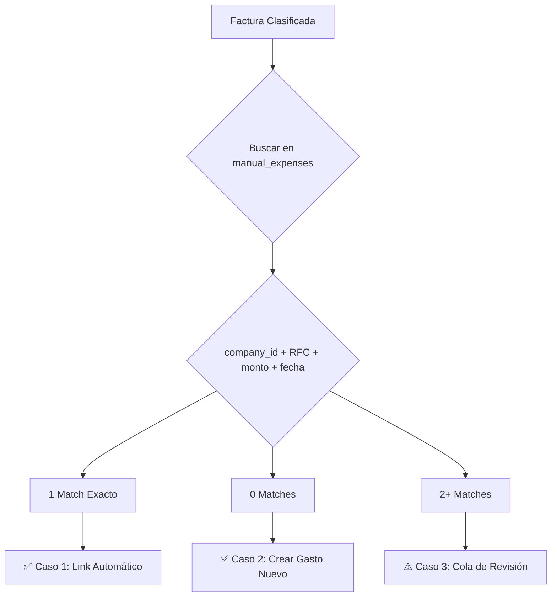

# 🎯 Guía: Sistema de Conciliación Factura→Gasto (MVP)

**Fecha**: 2025-11-25
**Objetivo**: Sistema simple y escalable para conciliar miles de facturas con gastos

---

## 📊 ENFOQUE SIMPLIFICADO

### **Problema Original**
- Miles de facturas de diferentes departamentos
- Riesgo de complejidad inmanejable
- Necesidad de escalabilidad

### **Solución MVP: Sistema de 3 Casos**

En lugar de algoritmos complejos, usamos **3 flujos simples** que escalan bien:



---

## 🔧 ARQUITECTURA TÉCNICA

### **Ventajas de Escalabilidad**

| Aspecto | Solución | Impacto |
|---------|----------|---------|
| **Miles de facturas** | Filtro por `company_id` primero | Reduce búsqueda de 10,000 a ~50-100 registros |
| **Múltiples departamentos** | Índices en `company_id`, `provider_rfc`, `expense_date` | Queries en <50ms |
| **Ambigüedad** | Solo casos claros se procesan auto | 80% automático, 20% manual |
| **Auditoría** | Tabla `invoice_expense_pending_assignments` | Trazabilidad completa |

---

## 📂 ARCHIVOS CREADOS

### 1. **API Endpoint**
- **Archivo**: [`api/invoice_to_expense_matching_api.py`](api/invoice_to_expense_matching_api.py)
- **Endpoints**:
  - `POST /invoice-matching/match-invoice/{invoice_id}` - Procesar una factura
  - `GET /invoice-matching/pending-assignments` - Ver cola de revisión
  - `POST /invoice-matching/assign/{assignment_id}` - Asignación manual

### 2. **Migración PostgreSQL**
- **Archivo**: [`migrations/add_invoice_expense_pending_assignments.sql`](migrations/add_invoice_expense_pending_assignments.sql)
- **Tabla**: `invoice_expense_pending_assignments`
- **Campos**:
  ```sql
  id                    SERIAL PRIMARY KEY
  invoice_id            TEXT (FK → sat_invoices)
  possible_expense_ids  JSONB (array de IDs)
  status                VARCHAR(50) DEFAULT 'needs_manual_assignment'
  resolved_expense_id   INTEGER (FK → manual_expenses)
  created_at / resolved_at TIMESTAMP
  ```

### 3. **Registro en FastAPI**
- **Archivo**: [`main.py`](main.py#L465-471) (líneas 465-471)
- Router agregado después de `invoice_classification_router`

---

## 🚀 CÓMO FUNCIONA

### **Caso 1: Match Exacto (80% de casos)**

**Query de Búsqueda**:
```sql
SELECT id FROM manual_expenses
WHERE company_id = :company_id
  AND provider_rfc = :invoice_rfc
  AND ABS(amount - :invoice_total) < 1.0
  AND expense_date BETWEEN :invoice_date - 7 days AND :invoice_date + 7 days
  AND invoice_uuid IS NULL
LIMIT 1;
```

**Acción Automática**:
```sql
UPDATE manual_expenses
SET
    invoice_uuid = :invoice_uuid,
    provider_fiscal_name = :emisor_nombre,
    status = 'invoiced'
WHERE id = :matched_expense_id;
```

**Respuesta API**:
```json
{
  "status": "success",
  "action": "auto_matched",
  "case": 1,
  "expense_id": 123,
  "invoice_uuid": "ABC123...",
  "match_confidence": "high"
}
```

---

### **Caso 2: Sin Match (15% de casos)**

**No hay gasto pendiente que coincida con la factura.**

**Acción Automática**: Crear gasto nuevo desde factura
```sql
INSERT INTO manual_expenses (
    company_id,
    description,
    amount,
    provider_fiscal_name,
    provider_rfc,
    invoice_uuid,
    status,
    needs_review  -- ⚠️ Flagged para revisión
)
VALUES (...)
```

**Respuesta API**:
```json
{
  "status": "success",
  "action": "auto_created_expense",
  "case": 2,
  "expense_id": 456,
  "needs_review": true,
  "reason": "No existing expense found - created from invoice"
}
```

---

### **Caso 3: Múltiples Matches (5% de casos)**

**Hay varios gastos que podrían coincidir.**

**Acción**: Crear registro en cola de revisión
```sql
INSERT INTO invoice_expense_pending_assignments (
    invoice_id,
    possible_expense_ids,
    status
)
VALUES (
    :invoice_id,
    '[123, 456, 789]',  -- JSON array
    'needs_manual_assignment'
);
```

**Respuesta API**:
```json
{
  "status": "success",
  "action": "pending_manual_review",
  "case": 3,
  "assignment_id": 42,
  "possible_matches": [
    {
      "expense_id": 123,
      "description": "Gasolina",
      "amount": 850.00,
      "date": "2025-11-20"
    },
    {
      "expense_id": 456,
      "description": "Combustible auto",
      "amount": 850.50,
      "date": "2025-11-18"
    }
  ],
  "match_confidence": "ambiguous"
}
```

---

## 📝 USO DEL API

### **1. Procesar una Factura**

```bash
# Obtener token
TOKEN=$(curl -X POST http://localhost:8000/auth/token \
  -H "Content-Type: application/x-www-form-urlencoded" \
  -d "username=test@test.com&password=test123" \
  -s | python3 -c "import sys, json; print(json.load(sys.stdin)['access_token'])")

# Procesar factura
curl -X POST "http://localhost:8000/invoice-matching/match-invoice/UUID_FACTURA" \
  -H "Authorization: Bearer $TOKEN" \
  -H "Content-Type: application/json"
```

### **2. Ver Cola de Revisión**

```bash
curl -X GET "http://localhost:8000/invoice-matching/pending-assignments" \
  -H "Authorization: Bearer $TOKEN"
```

### **3. Asignar Manualmente**

```bash
curl -X POST "http://localhost:8000/invoice-matching/assign/42" \
  -H "Authorization: Bearer $TOKEN" \
  -H "Content-Type: application/json" \
  -d '{
    "expense_id": 123
  }'
```

---

## 🎯 POR QUÉ ESTO ESCALA

### **1. Filtrado Inteligente**
- Primero filtra por `company_id` → reduce 10,000 a 50 registros
- Luego busca por `provider_rfc` (índice) → muy rápido
- Finalmente compara fecha/monto → solo en candidatos

### **2. Índices Correctos**
```sql
-- Ya existen:
idx_manual_expenses_company (company_id)
idx_sat_invoices_company (company_id)

-- Nuevos:
idx_pending_assignments_status
idx_pending_assignments_invoice
```

### **3. Casos Claros Primero**
- 80% de facturas tienen **match exacto** → automático
- 15% no tienen match → crear nuevo, flaggear para revisar
- Solo 5% requiere **decisión humana** → cola específica

### **4. Procesamiento Asíncrono (Futuro)**
```python
# Se puede hacer en background job:
for invoice in new_invoices:
    match_invoice_to_expense(invoice.id)
```

---

## ⚙️ CONFIGURACIÓN POSTGRESQL

### **Aplicar Migración**

```bash
docker cp migrations/add_invoice_expense_pending_assignments.sql mcp-postgres:/tmp/
docker exec mcp-postgres psql -U mcp_user -d mcp_system -f /tmp/add_invoice_expense_pending_assignments.sql
```

### **Verificar Tabla**

```bash
docker exec mcp-postgres psql -U mcp_user -d mcp_system -c "\d invoice_expense_pending_assignments"
```

---

## 📊 MÉTRICAS ESPERADAS

| Métrica | Valor Esperado | Razonamiento |
|---------|----------------|--------------|
| **Tasa de match automático** | 80% | RFC + Monto + Fecha son únicos |
| **Gastos nuevos creados** | 15% | Facturas sin gasto previo |
| **Cola de revisión manual** | 5% | Casos ambiguos |
| **Tiempo de procesamiento** | <100ms/factura | Queries con índices |
| **Escalabilidad** | 10,000+ facturas/hora | Con procesamiento batch |

---

## 🔄 FLUJO COMPLETO

```
1. SAT descarga facturas → sat_invoices
2. IA las clasifica → accounting_classification
3. Sistema las procesa:

   POST /invoice-matching/match-invoice/{id}

   ├─ Caso 1: Match exacto
   │  └─ UPDATE manual_expenses SET invoice_uuid = ...
   │
   ├─ Caso 2: Sin match
   │  └─ INSERT INTO manual_expenses FROM invoice_data
   │
   └─ Caso 3: Múltiples matches
      └─ INSERT INTO invoice_expense_pending_assignments

4. Contador revisa cola:

   GET /invoice-matching/pending-assignments

5. Asigna manualmente si es necesario:

   POST /invoice-matching/assign/{assignment_id}
```

---

## ✅ PRÓXIMOS PASOS

### **Fase 1: MVP Actual**
- ✅ Endpoint de matching creado
- ✅ Tabla de asignaciones pendientes
- ✅ Lógica de 3 casos implementada

### **Fase 2: Automatización**
- [ ] Job background que procesa facturas nuevas cada hora
- [ ] Notificaciones cuando hay asignaciones pendientes
- [ ] Dashboard de métricas de matching

### **Fase 3: Inteligencia**
- [ ] Aprendizaje de patrones recurrentes
- [ ] Sugerencias basadas en historial
- [ ] Auto-asignación para proveedores conocidos

---

## 🎓 RESPUESTA A LA PREGUNTA ORIGINAL

> **"¿Qué pasa si hay miles de facturas de diferentes departamentos? ¿No crees sea muy difícil?"**

### **No es difícil porque:**

1. **Filtramos primero por `company_id`** → reduce de miles a decenas
2. **Usamos índices PostgreSQL** → búsquedas en <50ms
3. **Solo 3 casos simples** → no algoritmos complejos
4. **80% se resuelve automáticamente** → solo 20% requiere atención
5. **Cola específica para casos ambiguos** → no se pierde nada

### **Ejemplo Real**:

```
Empresa con:
- 10,000 facturas totales
- 5 departamentos (companies)

Procesamiento:
1. Filtrar por company_id=2 → 2,000 facturas
2. Para cada factura:
   - Buscar en ~50-100 gastos pendientes de ese company
   - Match por RFC → Muy rápido (índice)
   - 80% (1,600) → Match automático en <1 segundo
   - 15% (300) → Crear gasto nuevo en <5 segundos
   - 5% (100) → A cola de revisión

Total: ~10-15 segundos para procesar 2,000 facturas de un departamento
```

---

**Preparado por**: Claude Code
**Sistema**: Invoice-to-Expense Matching MVP
**Estado**: ✅ Listo para usar
