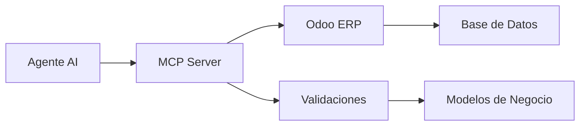

# MCP Server - Enterprise Expense Management

🚀 **MCP Server** es una solución completa para gestión de gastos empresariales que actúa como capa universal entre agentes AI y sistemas ERP como Odoo.

[](https://python.org)
[](https://odoo.com)
[]()

## ✨ Características

- 🏢 **Integración completa con Odoo** - Creación real de gastos en ERP
- 💰 **Gestión de gastos empresariales** - Validación, categorización y seguimiento
- 🧾 **Información fiscal México** - Soporte para CFDI, RFC y facturación
- 🔒 **Seguro** - Configuración por variables de entorno
- 📱 **API REST** - Endpoints simples y documentados
- ⚡ **Lightweight** - Sin dependencias pesadas, puede ejecutarse con HTTP básico

## 🚀 Instalación Rápida

### Opción 1: Servidor Básico (Recomendado)
```bash
# Clonar proyecto
git clone [tu-repo]
cd mcp-server

# Configurar variables de entorno
cp .env.example .env
# Editar .env con tus credenciales de Odoo

# Ejecutar servidor básico (sin dependencias)
python3 simple_server.py
```

### Opción 2: Servidor FastAPI Completo
```bash
# Instalar dependencias
pip install -r requirements.txt

# Ejecutar con FastAPI
python3 main.py
```

## ⚙️ Configuración

Crear archivo `.env` con tus credenciales:

```env
# Configuración Odoo
ODOO_URL=https://tu-instancia.odoo.com
ODOO_DB=tu-base-datos
ODOO_USERNAME=tu-email@empresa.com
ODOO_PASSWORD=tu-password

# Configuración Servidor
MCP_SERVER_PORT=8004
MCP_SERVER_HOST=localhost
```

## 🔥 Uso

### Crear Gasto Simple
```bash
curl -X POST "http://localhost:8004/mcp" \
  -H "Content-Type: application/json" \
  -d '{
    "method": "create_expense",
    "params": {
      "description": "🍽️ Comida de trabajo",
      "amount": 450.0,
      "employee": "Juan Pérez"
    }
  }'
```

**Respuesta:**
```json
{
  "success": true,
  "data": {
    "expense_id": "7",
    "status": "pending_approval",
    "amount": 450.0,
    "odoo_id": 7
  }
}
```

### Crear Gasto Empresarial Completo
```bash
curl -X POST "http://localhost:8004/mcp" \
  -H "Content-Type: application/json" \
  -d '{
    "method": "create_complete_expense",
    "params": {
      "name": "Gasolina viaje de negocios",
      "amount": 800.0,
      "supplier": {
        "name": "Gasolinera PEMEX",
        "rfc": "PEM850101ABC"
      },
      "tax_info": {
        "subtotal": 689.66,
        "iva_amount": 110.34,
        "total": 800.0
      },
      "account_code": "5201001",
      "payment_method": "tarjeta_empresa"
    }
  }'
```

### Obtener Gastos
```bash
curl -X POST "http://localhost:8004/mcp" \
  -H "Content-Type: application/json" \
  -d '{"method": "get_expenses", "params": {}}'
```

## 📊 Endpoints Disponibles

| Endpoint | Método | Descripción |
|----------|--------|-------------|
| `/` | GET | Health check |
| `/mcp` | POST | Llamadas MCP principales |
| `/methods` | GET | Lista métodos soportados |

## 📁 Estructura del Proyecto

```
mcp-server/
├── 🐍 simple_server.py              # Servidor HTTP básico (RECOMENDADO)
├── 🚀 main.py                       # Servidor FastAPI avanzado
├── 📦 requirements.txt              # Dependencias Python
├── 🔒 .env.example                  # Plantilla configuración
├── 🛡️ .gitignore                   # Archivos ignorados
├── core/
│   ├── 🧠 mcp_handler.py           # Lógica principal MCP
│   ├── 📋 expense_models.py        # Modelos de datos
│   └── ✅ expense_validator.py      # Validaciones
├── connectors/
│   ├── 🔗 enhanced_odoo_connector.py # Integración Odoo avanzada
│   └── 📊 direct_odoo_connector.py   # Integración Odoo directa
├── config/
│   └── ⚙️ config.py                # Configuración general
└── examples/
    ├── 🍽️ create_food_expense.py   # Ejemplo gasto comida
    └── ⛽ fix_gasoline_expense.py   # Ejemplo gasto gasolina
```

## 🎯 Métodos MCP Soportados

### Gestión de Gastos
- `create_expense` - Crear gasto básico
- `create_complete_expense` - Crear gasto empresarial completo
- `get_expenses` - Listar gastos desde Odoo
- `get_expenses_enhanced` - Gastos con información detallada

### Otros
- `get_inventory` - Gestión de inventario (demo)
- `create_order` - Crear órdenes (demo)

## 🏗️ Arquitectura



## 🔒 Seguridad

- ✅ **Variables de entorno** - No credenciales en código
- ✅ **Validación de datos** - Modelos Pydantic y validadores personalizados
- ✅ **Gitignore** - Archivos sensibles excluidos
- ✅ **HTTPS** - Soporta conexiones seguras a Odoo

## 🧪 Testing

### Probar Integración Odoo
```bash
# Verificar conexión
python3 -c "from connectors.direct_odoo_connector import get_expenses; print(get_expenses())"

# Crear gasto de prueba
python3 create_food_expense.py
```

### Probar Servidor
```bash
# Health check
curl http://localhost:8004/

# Listar métodos
curl http://localhost:8004/methods
```

## 🚦 Estados del Proyecto

| Componente | Estado | Descripción |
|------------|--------|-------------|
| 🟢 **Integración Odoo** | ✅ Funcional | Creación real de gastos |
| 🟢 **Validaciones** | ✅ Completo | RFC, montos, fechas |
| 🟢 **API REST** | ✅ Estable | Endpoints documentados |
| 🟡 **CFDI** | 🚧 Parcial | Estructura lista, pendiente validación |
| 🟡 **Autenticación** | 🚧 Básico | Variables de entorno |

## 🛠️ Desarrollo

### Agregar Nuevo Método MCP
1. Editar `core/mcp_handler.py`
2. Agregar función `_handle_nuevo_metodo()`
3. Registrar en `handle_mcp_request()`
4. Actualizar documentación

### Agregar Nuevo Conector
1. Crear archivo en `connectors/`
2. Implementar clase con métodos estándar
3. Agregar configuración en `.env.example`
4. Documentar en README

## 📈 Roadmap

- [ ] Autenticación JWT
- [ ] Rate limiting
- [ ] Webhooks de Odoo
- [ ] Conectores adicionales (SAT, bancos)
- [ ] Dashboard web
- [ ] Métricas y monitoring

## 🤝 Contribuir

1. Fork el proyecto
2. Crear branch: `git checkout -b feature/nueva-funcionalidad`
3. Commit: `git commit -am 'Agregar funcionalidad'`
4. Push: `git push origin feature/nueva-funcionalidad`
5. Pull Request

## 📄 Licencia

MIT License - Ver archivo `LICENSE` para detalles.

## 🆘 Soporte

- 📧 Email: soporte@empresa.com
- 📖 Documentación: [Wiki del proyecto]
- 🐛 Issues: [GitHub Issues]

---

🚀 **¡Listo para gestionar gastos empresariales como un profesional!**