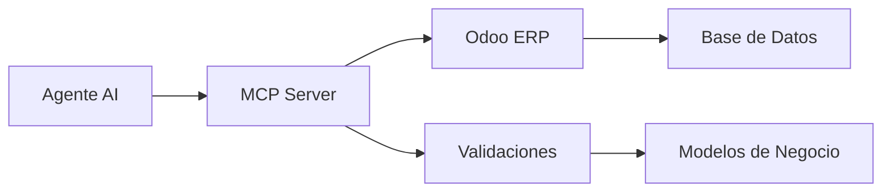

# MCP Server - Enterprise Expense Management

🚀 **MCP Server** es una solución completa para gestión de gastos empresariales que actúa como capa universal entre agentes AI y sistemas ERP como Odoo.

[](https://python.org)
[](https://odoo.com)
[]()

## ✨ Características

- 🏢 **Integración completa con Odoo** - Creación real de gastos en ERP
- 💰 **Gestión de gastos empresariales** - Validación, categorización y seguimiento
- 🏢 **Multiempresa** - `company_id` en gastos, facturas y conciliación para separar unidades de negocio
- 🚀 **Onboarding Express** - Registro vía WhatsApp o Gmail/Hotmail con datos demo automáticos
- 🧾 **Información fiscal México** - Soporte para CFDI, RFC y facturación
- 🎤 **Procesamiento de voz** - Entrada y salida por audio usando OpenAI Whisper y TTS
- 📲 **Facturación automática WhatsApp** - Facturación de tickets enviados por WhatsApp
- 🏪 **Detección de comercios** - Identificación automática de merchants para facturación
- 🤖 **Jobs de procesamiento** - Sistema de trabajos para facturación asíncrona
- 🔒 **Seguro** - Configuración por variables de entorno
- 📱 **API REST** - Endpoints simples y documentados
- ⚡ **Lightweight** - Sin dependencias pesadas, puede ejecutarse con HTTP básico

## 🚀 Instalación Rápida

### Opción 1: Servidor Básico (Recomendado)
```bash
# Clonar proyecto
git clone [tu-repo]
cd mcp-server

# Configurar variables de entorno
cp .env.example .env
# Editar .env con tus credenciales de Odoo

# Ejecutar servidor básico (sin dependencias)
python3 simple_server.py
```

### Opción 2: Servidor FastAPI Completo
```bash
# Instalar dependencias
pip install -r requirements.txt

# Ejecutar con FastAPI
python3 main.py
```

## ⚙️ Configuración

Crear archivo `.env` con tus credenciales:

```env
# Configuración Odoo
ODOO_URL=https://tu-instancia.odoo.com
ODOO_DB=tu-base-datos
ODOO_USERNAME=tu-email@empresa.com
ODOO_PASSWORD=tu-password

# Configuración Servidor
MCP_SERVER_PORT=8004
MCP_SERVER_HOST=localhost

# OpenAI para procesamiento de voz (opcional)
OPENAI_API_KEY=sk-your-openai-api-key-here
```

### 📂 Base de datos interna

- La app ahora incluye una base SQLite (`data/mcp_internal.db`) con un catálogo contable precargado.
- El catálogo agrega 30 cuentas básicas organizadas por activo, pasivo, capital, ingresos, costos, gastos e IVA.
- En cada arranque el servidor valida la existencia de las cuentas y crea las que falten, por lo que no se requiere configuración manual.
- Personaliza la ruta con las variables `INTERNAL_DATA_DIR` o `INTERNAL_DB_PATH` si deseas guardar la base en otra ubicación.
- Se creó la tabla `expense_records` para que más adelante podamos registrar gastos internos con o sin factura y ligarlos a las cuentas del catálogo.
- También se incluyen tablas de `bank_movements` y `bank_match_feedback` para preparar la conciliación bancaria asistida.
- Todas las tablas clave (`expense_records`, `bank_movements`, `expense_invoices`, etc.) incluyen ahora `company_id` para aislar datos por empresa.
- El onboarding crea la tabla `users` y genera datos demo por empresa cuando un usuario se registra.

### 🤖 Conciliación bancaria asistida (demo IA)

- Endpoint `POST /bank_reconciliation/suggestions` genera coincidencias banco ↔ gasto con un puntaje de confianza.
- Endpoint `POST /bank_reconciliation/feedback` guarda la decisión del usuario (aceptado, rechazado o manual) para refinar la lógica.
- `GET /bank_reconciliation/movements` expone los cargos almacenados en la base interna.
- En la UI de voz, sección “Conciliación bancaria” muestra sugerencias con badges de confianza y permite aceptarlas o rechazarlas.
- El motor detecta pagos fragmentados (2-3 cargos que suman el gasto) y lo destaca como “pago en varios cargos”.
- El flujo del gasto puede cerrarse marcándolo como “No se pudo facturar”, lo cual actualiza automáticamente sus asientos.
- Endpoint `POST /invoices/parse` analiza el XML CFDI para extraer subtotal, IVA y otros impuestos y alimentar los asientos.

### 🔁 Flujo operativo Gasto → Factura → Conciliación de gastos → Banco

1. **Captura del gasto** — Se registra por voz, ticket OCR o manual. El backend guarda `invoice_status = pendiente`, `will_have_cfdi = true` y la UI lo muestra en *Gastos sin conciliar* con badge naranja.
2. **Adjuntar factura** — Desde “Facturas pendientes” (`/expenses/{id}/invoice`) se vincula el CFDI o se marca como no facturable. Si llega factura, el gasto pasa a `invoice_status = facturado` y aparece en la pestaña *Conciliación de gastos* con badge verde “Listo para conciliar en bancos”.
3. **Conciliación de gastos** — En el modal “Conciliar Gastos” se revisa el match gasto ↔ factura antes de ir al banco. Todos los registros con `invoice_status = facturado` y `bank_status ≠ conciliado_banco` se muestran como “Listos para conciliación bancaria”.
4. **Conciliación bancaria** — Al abrir “Conciliación bancaria” se comparan esos gastos con los movimientos (`bank_status = pendiente_bancaria`). Al aceptar una sugerencia o seleccionar un cargo manualmente, el backend actualiza `bank_status = conciliado_banco` y el gasto migra al panel de conciliados.

> Tip: si un gasto se marca como “No facturable”, la UI y los estados (`invoice_status = sin_factura`, `bank_status = sin_factura`) lo excluyen automáticamente de las etapas de conciliación.

## 🔥 Uso

### Crear Gasto Simple
```bash
curl -X POST "http://localhost:8004/mcp" \
  -H "Content-Type: application/json" \
  -d '{
    "method": "create_expense",
    "params": {
      "description": "🍽️ Comida de trabajo",
      "amount": 450.0,
      "employee": "Juan Pérez"
    }
  }'
```

**Respuesta:**
```json
{
  "success": true,
  "data": {
    "expense_id": "7",
    "status": "pending_approval",
    "amount": 450.0,
    "odoo_id": 7
  }
}
```

### Crear Gasto Empresarial Completo
```bash
curl -X POST "http://localhost:8004/mcp" \
  -H "Content-Type: application/json" \
  -d '{
    "method": "create_complete_expense",
    "params": {
      "name": "Gasolina viaje de negocios",
      "amount": 800.0,
      "supplier": {
        "name": "Gasolinera PEMEX",
        "rfc": "PEM850101ABC"
      },
      "tax_info": {
        "subtotal": 689.66,
        "iva_amount": 110.34,
        "total": 800.0
      },
      "account_code": "5201001",
      "payment_method": "tarjeta_empresa"
    }
  }'
```

### Obtener Gastos
```bash
curl -X POST "http://localhost:8004/mcp" \
  -H "Content-Type: application/json" \
  -d '{"method": "get_expenses", "params": {}}'
```

### 🎤 Procesamiento de Voz (Nuevo)

#### Requisitos para Voz
```bash
# Instalar dependencias adicionales
pip install openai pydub

# Configurar OpenAI API Key
export OPENAI_API_KEY="sk-your-api-key-here"
```

#### Usar Voz para Crear Gastos
```bash
# Grabar audio diciendo: "Registrar gasto de gasolina de 500 pesos"
curl -X POST "http://localhost:8000/voice_mcp" \
  -F "file=@mi_audio.mp3"
```

**Respuesta con voz:**
```json
{
  "success": true,
  "transcript": "Registrar gasto de gasolina de 500 pesos",
  "mcp_response": {
    "success": true,
    "data": {"expense_id": "9", "amount": 500.0}
  },
  "response_text": "Gasto creado exitosamente por 500 pesos con ID 9",
  "audio_file_url": "/audio/response_12345.mp3"
}
```

#### Descargar Audio de Respuesta
```bash
# El sistema genera una respuesta en audio automáticamente
curl "http://localhost:8000/audio/response_12345.mp3" -o respuesta.mp3
```

## 📊 Endpoints Disponibles

| Endpoint | Método | Descripción |
|----------|--------|-------------|
| `/` | GET | Health check |
| `/mcp` | POST | Llamadas MCP principales |
| `/voice_mcp` | POST | MCP con entrada y salida de voz |
| `/audio/{filename}` | GET | Descargar archivos de audio generados |
| `/methods` | GET | Lista métodos soportados |

## 📁 Estructura del Proyecto

```
mcp-server/
├── 🐍 simple_server.py              # Servidor HTTP básico (RECOMENDADO)
├── 🚀 main.py                       # Servidor FastAPI avanzado
├── 📦 requirements.txt              # Dependencias Python
├── 🔒 .env.example                  # Plantilla configuración
├── 🛡️ .gitignore                   # Archivos ignorados
├── core/
│   ├── 🧠 mcp_handler.py           # Lógica principal MCP
│   ├── 📋 expense_models.py        # Modelos de datos
│   ├── ✅ expense_validator.py      # Validaciones
│   └── 🎤 voice_handler.py         # Procesamiento de voz (Whisper + TTS)
├── connectors/
│   ├── 🔗 enhanced_odoo_connector.py # Integración Odoo avanzada
│   └── 📊 direct_odoo_connector.py   # Integración Odoo directa
├── config/
│   └── ⚙️ config.py                # Configuración general
└── examples/
    ├── 🍽️ create_food_expense.py   # Ejemplo gasto comida
    ├── ⛽ fix_gasoline_expense.py   # Ejemplo gasto gasolina
    └── 🎤 voice_test_example.py    # Test procesamiento de voz
```

## 🗃️ ERP Interno (SQLite)

El servidor incluye un ERP interno ligero persistido en SQLite. El esquema se gestiona con migraciones automáticas (`schema_versions`) y se inicializa al arrancar (`core/internal_db.initialize_internal_database`). Tablas clave:

- `expense_records`: gastos con columnas normalizadas (fecha, categoría, proveedor, estados de factura/conciliación, campos de pago). Los datos adicionales se guardan en `metadata` (JSON).
- `expense_invoices`: historial de facturas asociadas a un gasto (uuid, folio, URL, estatus, XML raw).
- `expense_bank_links`: vínculos gasto ↔ movimiento bancario para conciliación manual o automática.
- `expense_events`: log auditable de acciones (creación, registros de factura, cambios de estado, conciliaciones).
- `bank_movements`: movimientos bancarios con campos `account`, `movement_type`, `balance`, `metadata`.

Migraciones disponibles:

1. `0001_initial`: catálogo de cuentas, gastos básicos, movimientos bancarios y feedback de conciliación.
2. `0002_expense_extended`: amplía `expense_records` con campos explícitos, crea tablas de facturas/eventos/enlaces y extiende `bank_movements`.

## 🔗 Endpoints REST Clave

FastAPI expone operaciones sobre el ERP interno (todas en JSON):

- `POST /expenses` — crea un gasto nuevo (`ExpenseCreate` → `ExpenseResponse`).
- `PUT /expenses/{id}` — actualiza un gasto existente.
- `GET /expenses` — lista gastos con los campos normalizados del ERP interno (acepta filtros `mes=YYYY-MM`, `categoria`, `estatus`).
- `POST /expenses/{id}/invoice` — registra/actualiza datos de factura (uuid, folio, URL, estatus).
- `POST /expenses/{id}/mark-invoiced` — marca el gasto como facturado (actualiza `invoice_status`).
- `POST /expenses/{id}/close-no-invoice` — cierra el gasto como “sin factura”.
- `GET /bank_reconciliation/movements` — consulta movimientos bancarios almacenados (incluye `tags`, `account`, `movement_type`).
- `POST /bank_reconciliation/suggestions` & `/feedback` — sugerencias IA y feedback de conciliación.
- `POST /expenses/check-duplicates`, `/expenses/predict-category`, `/invoices/parse` — utilidades IA/OCR.

### 📲 Facturación Automática WhatsApp

- `POST /invoicing/tickets` — subir ticket de compra para facturación automática.
- `GET /invoicing/tickets/{id}` — obtener estado y detalles de un ticket.
- `GET /invoicing/tickets` — listar tickets con filtros (estado, empresa).
- `POST /invoicing/bulk-match` — carga masiva de tickets para procesamiento en lote.
- `POST /invoicing/webhooks/whatsapp` — webhook para mensajes entrantes de WhatsApp.
- `GET /invoicing/merchants` — listar merchants disponibles para facturación.
- `POST /invoicing/merchants` — crear nuevo merchant con método de facturación.
- `GET /invoicing/jobs` — ver jobs de procesamiento pendientes y completados.
- `POST /invoicing/jobs/{id}/process` — procesar job específico manualmente.
- `POST /invoicing/tickets/{id}/create-expense` — crear gasto desde ticket procesado.

Todas las operaciones de escritura registran eventos en `expense_events` para trazabilidad.

## 🎯 Métodos MCP Soportados

### Gestión de Gastos
- `create_expense` - Crear gasto básico
- `create_complete_expense` - Crear gasto empresarial completo
- `get_expenses` - Listar gastos desde Odoo
- `get_expenses_enhanced` - Gastos con información detallada

### Procesamiento de Voz
- `voice_mcp` - Endpoint con entrada y salida de voz
- `audio/{filename}` - Servir archivos de audio generados

### Facturación Automática
- `invoicing_upload_ticket` - Subir ticket para facturación automática
- `invoicing_ticket_status` - Ver estado de procesamiento de ticket
- `invoicing_bulk_upload` - Carga masiva de tickets
- `whatsapp_webhook` - Recibir mensajes de WhatsApp
- `invoicing_merchants` - Gestión de comercios para facturación
- `invoicing_jobs` - Ver trabajos de procesamiento

### Otros
- `get_inventory` - Gestión de inventario (demo)
- `create_order` - Crear órdenes (demo)

## 📲 Facturación de Tickets vía WhatsApp

El módulo **invoicing_agent** permite facturar automáticamente tickets de compra recibidos por WhatsApp, perfecto para usuarios en plan freemium.

### 🔄 Flujo de Facturación

1. **Usuario envía ticket** por WhatsApp (foto, PDF, texto, o voz)
2. **Sistema guarda el ticket** con metadata mínima
3. **Se dispara un job** que:
   - Detecta el comercio usando AI/OCR
   - Usa credenciales globales para facturación
   - Obtiene CFDI XML + PDF
4. **Crea expense_record** y actualiza estado
5. **Gasto aparece** en Conciliación bancaria

### 📝 Ejemplos de Uso

#### Subir ticket de imagen
```bash
curl -X POST "http://localhost:8000/invoicing/tickets" \
  -F "file=@ticket_oxxo.jpg" \
  -F "user_id=123" \
  -F "company_id=mi_empresa"
```

#### Ver estado del ticket
```bash
curl "http://localhost:8000/invoicing/tickets/1"
```

#### Webhook WhatsApp
```bash
curl -X POST "http://localhost:8000/invoicing/webhooks/whatsapp" \
  -H "Content-Type: application/json" \
  -d '{
    "message_id": "wa_123",
    "from_number": "+525512345678",
    "message_type": "image",
    "content": "Mi ticket de Walmart",
    "media_url": "https://wa.me/media/ticket.jpg"
  }'
```

#### Carga masiva
```bash
curl -X POST "http://localhost:8000/invoicing/bulk-match" \
  -H "Content-Type: application/json" \
  -d '{
    "tickets": [
      {"raw_data": "OXXO TOTAL: $125.50", "tipo": "texto"},
      {"raw_data": "WALMART TOTAL: $350.00", "tipo": "texto"}
    ],
    "auto_process": true,
    "company_id": "mi_empresa"
  }'
```

### ⚙️ Configuración

Variables de entorno para facturación:

```env
# Credenciales globales para portales
INVOICING_EMAIL=empresa@midominio.com
INVOICING_PASSWORD=mi_password_seguro
COMPANY_RFC=XAXX010101000
COMPANY_NAME=Mi Empresa SA de CV

# WhatsApp API
WHATSAPP_API_KEY=tu_api_key_whatsapp
```

### 🏪 Merchants Soportados

El sistema incluye merchants preconfigurados:

- **OXXO** - Portal web con login empresarial
- **Walmart** - Facturación por email
- **Costco** - API REST para facturación
- **Home Depot** - Portal con código de recibo

### 🤖 Worker de Procesamiento

Para procesar jobs automáticamente:

```bash
# Ejecutar worker en background
python -m modules.invoicing_agent.worker default 30

# O integrar en tu sistema de colas (Celery, etc.)
```

## 🏗️ Arquitectura



## 🔒 Seguridad

- ✅ **Variables de entorno** - No credenciales en código
- ✅ **Validación de datos** - Modelos Pydantic y validadores personalizados
- ✅ **Gitignore** - Archivos sensibles excluidos
- ✅ **HTTPS** - Soporta conexiones seguras a Odoo

## 🧪 Testing

### Probar Integración Odoo
```bash
# Verificar conexión
python3 -c "from connectors.direct_odoo_connector import get_expenses; print(get_expenses())"

# Crear gasto de prueba
python3 create_food_expense.py
```

### Probar Servidor
```bash
# Health check
curl http://localhost:8004/

# Listar métodos
curl http://localhost:8004/methods
```

## 🚦 Estados del Proyecto

| Componente | Estado | Descripción |
|------------|--------|-------------|
| 🟢 **Integración Odoo** | ✅ Funcional | Creación real de gastos |
| 🟢 **Validaciones** | ✅ Completo | RFC, montos, fechas |
| 🟢 **API REST** | ✅ Estable | Endpoints documentados |
| 🟡 **CFDI** | 🚧 Parcial | Estructura lista, pendiente validación |
| 🟡 **Autenticación** | 🚧 Básico | Variables de entorno |

## 🛠️ Desarrollo

### Agregar Nuevo Método MCP
1. Editar `core/mcp_handler.py`
2. Agregar función `_handle_nuevo_metodo()`
3. Registrar en `handle_mcp_request()`
4. Actualizar documentación

### Agregar Nuevo Conector
1. Crear archivo en `connectors/`
2. Implementar clase con métodos estándar
3. Agregar configuración en `.env.example`
4. Documentar en README

## 📈 Roadmap

- [ ] Autenticación JWT
- [ ] Rate limiting
- [ ] Webhooks de Odoo
- [ ] Conectores adicionales (SAT, bancos)
- [ ] Dashboard web
- [ ] Métricas y monitoring

## 🤝 Contribuir

1. Fork el proyecto
2. Crear branch: `git checkout -b feature/nueva-funcionalidad`
3. Commit: `git commit -am 'Agregar funcionalidad'`
4. Push: `git push origin feature/nueva-funcionalidad`
5. Pull Request

## 📄 Licencia

MIT License - Ver archivo `LICENSE` para detalles.

## 🆘 Soporte

- 📧 Email: soporte@empresa.com
- 📖 Documentación: [Wiki del proyecto]
- 🐛 Issues: [GitHub Issues]

---

🚀 **¡Listo para gestionar gastos empresariales como un profesional!**
- Onboarding vía `/onboarding/register` crea un workspace demo por usuario (WhatsApp o Gmail/Hotmail) y devuelve el `company_id` para consumir la experiencia de voz.
