# Flujo Completo de Clasificación Contable - Explicación Granular

## 📋 Índice
1. [Flujo End-to-End Completo](#flujo-end-to-end-completo)
2. [Fase 1: Procesamiento de Factura](#fase-1-procesamiento-de-factura)
3. [Fase 2: Búsqueda de Candidatos SAT](#fase-2-búsqueda-de-candidatos-sat)
4. [Fase 3: Clasificación con LLM](#fase-3-clasificación-con-llm)
5. [Fase 4: Confirmación del Contador](#fase-4-confirmación-del-contador)
6. [Fase 5: Aprendizaje del Sistema](#fase-5-aprendizaje-del-sistema)
7. [Ejemplos Reales Paso a Paso](#ejemplos-reales-paso-a-paso)

---

## 🌊 Flujo End-to-End Completo

```mermaid
graph TD
    A[Usuario sube XML CFDI] --> B[Universal Invoice Engine]
    B --> C[Parser XML extrae datos]
    C --> D[Guarda en BD: parsed_data]
    D --> E[Valida con SAT]
    E --> F{¿Tiene UUID?}
    F -->|Sí| G[Clasificación Contable]
    F -->|No| Z[Fin - Sin clasificar]

    G --> H[1. Obtener contexto empresa]
    H --> I[2. Generar embeddings del concepto]
    I --> J[3. Buscar candidatos SAT similares]
    J --> K[4. Preparar prompt para LLM]
    K --> L[5. Claude clasifica]
    L --> M[6. Guardar clasificación + trace]
    M --> N[Frontend muestra sugerencia]

    N --> O{Contador revisa}
    O -->|Confirma| P[Guardar confirmación]
    O -->|Corrige| Q[Guardar corrección en ai_correction_memory]

    P --> R[Actualizar métricas]
    Q --> R
    R --> S[Sistema aprende para próxima vez]
```



---

## 📥 Fase 1: Procesamiento de Factura

### Paso 1.1: Usuario Sube XML CFDI

**Archivo:** `core/expenses/invoices/universal_invoice_engine_system.py`

```python
# Usuario hace: POST /universal-invoice/process/carreta_verde
# Con archivo: factura_hector_audelo.xml

async def process_invoice(self, file_path: str, file_type: str):
    """
    Punto de entrada principal
    """
    # 1. Crear sesión en BD
    session_id = await self._create_session(file_path)
    # → session_id = "uis_9dcc3bcb1db677f3"

    # 2. Detectar formato
    detected_format = self._detect_format(file_path)
    # → detected_format = "cfdi_4.0"

    # 3. Parsear XML directamente (SIN LLM)
    from core.ai_pipeline.parsers.invoice_parser import parse_cfdi_xml

    with open(file_path, 'rb') as f:
        xml_content = f.read()

    parsed_data = parse_cfdi_xml(xml_content)
    # → parsed_data contiene TODOS los datos extraídos del XML
```

**Resultado `parsed_data`:**
```json
{
  "uuid": "7DFE1CE8-98CA-4BBB-A3BA-9E4F25A8297D",
  "serie": "CC",
  "folio": "7394",
  "fecha_emision": "2025-06-28T16:07:15",
  "fecha_timbrado": "2025-06-28T16:07:18",
  "tipo_comprobante": "I",
  "moneda": "MXN",
  "subtotal": 12799.8,
  "total": 12799.80,
  "descuento": 0,
  "forma_pago": "03",
  "metodo_pago": "PUE",
  "uso_cfdi": "G01",
  "lugar_expedicion": "15810",

  "emisor": {
    "rfc": "AUJH630825FL9",
    "nombre": "HECTOR LUIS AUDELO JARQUIN",
    "regimen_fiscal": "612"
  },

  "receptor": {
    "rfc": "POL210218264",
    "nombre": "POLLENBEEMX",
    "domicilio_fiscal": "76903",
    "regimen_fiscal": "601",
    "uso_cfdi": "G01"
  },

  "conceptos": [
    {
      "clave_prod_serv": "50101716",
      "no_identificacion": "NUEZ",
      "cantidad": 75.29297,
      "clave_unidad": "KGM",
      "unidad": "Kilo",
      "descripcion": "NUEZ",
      "valor_unitario": 170.0,
      "importe": 12799.80,
      "objeto_imp": "02"
    }
  ],

  "impuestos": {
    "total_traslados": 0.0,
    "total_retenciones": 0.0,
    "traslados": [
      {
        "base": 12799.80,
        "impuesto": "002",
        "tipo_factor": "Tasa",
        "tasa_o_cuota": 0.0,
        "importe": 0.0
      }
    ],
    "retenciones": []
  },

  "sat_status": "desconocido"  // Inferido por LLM (legacy)
}
```

### Paso 1.2: Guardar en Base de Datos

```python
# Guardar parsed_data en PostgreSQL
await self._save_processing_result(session_id, {
    "extracted_data": parsed_data,  # Datos extraídos
    "parser_used": "invoice_parser",  # Parser XML directo
    "extraction_confidence": 1.0,  # 100% confianza (XML parser)
    "overall_quality_score": 1.0
})

# SQL ejecutado:
UPDATE sat_invoices
SET
    parsed_data = %s,  -- ← Aquí va el JSON completo
    extracted_data = %s,  -- Por compatibilidad (mismo contenido)
    parser_used = 'invoice_parser',
    extraction_confidence = 1.0,
    extraction_status = 'completed',
    status = 'completed',
    completed_at = NOW()
WHERE id = 'uis_9dcc3bcb1db677f3';
```

**Estado de la BD después del Paso 1:**
```sql
SELECT id, parser_used, extraction_status,
       parsed_data->>'emisor' as emisor_json
FROM sat_invoices
WHERE id = 'uis_9dcc3bcb1db677f3';

-- Resultado:
-- id: uis_9dcc3bcb1db677f3
-- parser_used: invoice_parser
-- extraction_status: completed
-- emisor_json: {"rfc": "AUJH630825FL9", "nombre": "HECTOR LUIS AUDELO JARQUIN", ...}
```

### Paso 1.3: Validación SAT (ya implementado)

```python
# Se lanza en segundo plano
asyncio.create_task(self._trigger_sat_validation(session_id, result))

# Valida UUID contra servicios web del SAT
# Actualiza: sat_validation_status = 'vigente' | 'cancelado' | 'sustituido'
```

---

## 🔍 Fase 2: Búsqueda de Candidatos SAT

### Paso 2.1: Trigger de Clasificación Contable

**Archivo:** `core/expenses/invoices/universal_invoice_engine_system.py` (NUEVO)

```python
async def _save_processing_result(self, session_id, result, ...):
    # ... código existente que guarda parsed_data ...

    # ✅ NUEVO: Lanzar clasificación contable
    asyncio.create_task(
        self._classify_invoice_accounting(session_id, result)
    )

async def _classify_invoice_accounting(
    self,
    session_id: str,
    result: Dict[str, Any]
) -> None:
    """
    Clasificación contable usando embeddings + LLM
    Se ejecuta en segundo plano (no bloquea respuesta al usuario)
    """
    try:
        extracted_data = result.get('extracted_data', {})

        # Verificar que tenga UUID (es CFDI válido)
        uuid = extracted_data.get('uuid')
        if not uuid:
            logger.info(f"Session {session_id}: No UUID, skipping classification")
            return

        # Continuar con clasificación...
```

### Paso 2.2: Preparar Snapshot del Gasto

```python
# Extraer información relevante para clasificación
conceptos = extracted_data.get('conceptos', [])
primer_concepto = conceptos[0] if conceptos else {}

snapshot = {
    # ========================================
    # DATOS DEL CONCEPTO (lo que se compró)
    # ========================================
    "descripcion_original": primer_concepto.get('descripcion', ''),
    # → "NUEZ"

    "clave_prod_serv": primer_concepto.get('clave_prod_serv', ''),
    # → "50101716" (Clave SAT del producto)

    "cantidad": primer_concepto.get('cantidad', 0),
    # → 75.29297

    "unidad": primer_concepto.get('unidad', ''),
    # → "Kilo"

    "valor_unitario": primer_concepto.get('valor_unitario', 0),
    # → 170.0

    # ========================================
    # DATOS DEL PROVEEDOR
    # ========================================
    "provider_name": extracted_data.get('emisor', {}).get('nombre', ''),
    # → "HECTOR LUIS AUDELO JARQUIN"

    "provider_rfc": extracted_data.get('emisor', {}).get('rfc', ''),
    # → "AUJH630825FL9"

    "provider_regimen": extracted_data.get('emisor', {}).get('regimen_fiscal', ''),
    # → "612" (Persona Física con Actividad Empresarial)

    # ========================================
    # DATOS FINANCIEROS
    # ========================================
    "amount": extracted_data.get('total', 0),
    # → 12799.80

    "subtotal": extracted_data.get('subtotal', 0),
    # → 12799.8

    "impuestos_traslados": extracted_data.get('impuestos', {}).get('total_traslados', 0),
    # → 0.0 (no tiene IVA en este caso)

    # ========================================
    # CONTEXTO DE LA EMPRESA
    # ========================================
    "company_id": self.company_id,
    # → "carreta_verde"

    "tenant_id": self.tenant_id,
    # → 1

    "company_context": self._get_company_context(self.company_id),
    # → Este es CLAVE - explicado en siguiente paso
}
```

### Paso 2.3: Obtener Contexto de la Empresa

```python
def _get_company_context(self, company_id: str) -> Dict:
    """
    Obtiene el contexto de negocio de la empresa
    Esto personaliza la clasificación según la industria
    """
    from core.db_postgresql import get_db_sync
    db = next(get_db_sync())

    # 1. Obtener settings de la empresa
    company = db.execute("""
        SELECT settings
        FROM companies
        WHERE id = (
            SELECT id FROM companies
            WHERE tenant_id = (SELECT id FROM tenants WHERE name = %s)
            LIMIT 1
        )
    """, (company_id,)).fetchone()

    if not company:
        return {}

    settings = json.loads(company['settings'] or '{}')

    # 2. Obtener memoria AI de contexto
    ai_context = db.execute("""
        SELECT context, topics, summary
        FROM ai_context_memory
        WHERE company_id = (
            SELECT id FROM companies
            WHERE tenant_id = (SELECT id FROM tenants WHERE name = %s)
            LIMIT 1
        )
        ORDER BY context_version DESC
        LIMIT 1
    """, (company_id,)).fetchone()

    # 3. Construir contexto completo
    return {
        "industry": settings.get('industry', 'unknown'),
        # → "manufacturing_food"

        "business_type": settings.get('business_context', ''),
        # → "Procesadora de frutos secos - Producción y venta mayorista"

        "chart_of_accounts_type": settings.get('accounting', {}).get('chart_of_accounts_type', 'sat'),
        # → "custom" o "sat"

        "custom_accounts": settings.get('accounting', {}).get('custom_accounts', []),
        # → [{"code": "5101-001", "name": "Materia Prima - Frutos Secos", ...}]

        "ai_context": ai_context['context'] if ai_context else None,
        # → "Somos una empresa de producción de frutos secos, principalmente nueces..."

        "topics": json.loads(ai_context['topics']) if ai_context and ai_context['topics'] else [],
        # → ["agricultura", "producción", "materia_prima", "nueces"]

        "summary": ai_context['summary'] if ai_context else None,
        # → "Empresa procesadora de frutos secos"
    }
```

**Snapshot Completo Generado:**
```json
{
  "descripcion_original": "NUEZ",
  "clave_prod_serv": "50101716",
  "cantidad": 75.29297,
  "unidad": "Kilo",
  "valor_unitario": 170.0,

  "provider_name": "HECTOR LUIS AUDELO JARQUIN",
  "provider_rfc": "AUJH630825FL9",
  "provider_regimen": "612",

  "amount": 12799.80,
  "subtotal": 12799.8,
  "impuestos_traslados": 0.0,

  "company_id": "carreta_verde",
  "tenant_id": 1,

  "company_context": {
    "industry": "manufacturing_food",
    "business_type": "Procesadora de frutos secos - Producción y venta mayorista",
    "chart_of_accounts_type": "custom",
    "custom_accounts": [
      {
        "code": "5101-001",
        "name": "Materia Prima - Frutos Secos",
        "sat_mapping": "601.84.01",
        "deductible": 100
      }
    ],
    "ai_context": "Somos una empresa de producción de frutos secos, principalmente nueces. Compramos materia prima directo de productores y la procesamos para venta al mayoreo.",
    "topics": ["agricultura", "producción", "materia_prima", "nueces"],
    "summary": "Empresa procesadora de frutos secos"
  }
}
```

### Paso 2.4: Normalizar Descripción

```python
from core.shared.text_normalizer import normalize_expense_text

descripcion_normalizada = normalize_expense_text(
    snapshot["descripcion_original"]
)

# Input:  "NUEZ"
# Output: "nuez"

# Si fuera más complejo:
# Input:  "COMPRA DE NUEZ PECANERA 75 KG - PRODUCTOR LOCAL"
# Output: "compra nuez pecanera 75 kg productor local"
```

### Paso 2.5: Generar Embedding del Concepto

```python
from core.accounting.account_catalog import _load_sentence_model

# 1. Cargar modelo (caché - solo se carga una vez)
model = _load_sentence_model()
# Modelo: paraphrase-multilingual-MiniLM-L12-v2
# Dimensiones: 384

# 2. Generar embedding
query_embedding = model.encode([descripcion_normalizada])[0]
# → array([0.023, -0.145, 0.087, ...])  # 384 dimensiones
```

**¿Qué es un embedding?**
Un embedding es una representación numérica del significado semántico del texto.

```
"nuez"           → [0.023, -0.145, 0.087, ...]
"almendra"       → [0.019, -0.140, 0.091, ...]  # Similar
"gasolina"       → [-0.234, 0.456, -0.123, ...] # Diferente
```

### Paso 2.6: Buscar Candidatos SAT por Similitud

```python
from core.accounting.account_catalog import retrieve_sat_candidates_by_embedding

candidates = retrieve_sat_candidates_by_embedding(
    description=descripcion_normalizada,
    amount=snapshot["amount"],
    top_k=10  # Top 10 cuentas más similares
)

# Internamente hace:
# 1. Cargar embeddings pre-calculados del catálogo SAT
catalog_embeddings = load_sat_catalog_embeddings()
# → matriz de 5000+ filas x 384 columnas

# 2. Calcular similitud coseno
from sklearn.metrics.pairwise import cosine_similarity
similarities = cosine_similarity([query_embedding], catalog_embeddings)[0]
# → array([0.12, 0.89, 0.15, 0.72, ...])  # 5000+ valores

# 3. Ordenar por similitud descendente
top_indices = np.argsort(similarities)[::-1][:10]
# → [1523, 892, 234, ...]  # Índices de las 10 más similares

# 4. Construir lista de candidatos
candidates = []
for idx in top_indices:
    candidates.append({
        "code": catalog[idx]["code"],
        "name": catalog[idx]["name"],
        "family_hint": extract_family_code(catalog[idx]["code"]),
        "score": float(similarities[idx]),
        "description": catalog[idx].get("description", ""),
        "context": catalog[idx].get("context", "")
    })
```

**Resultado - Top 10 Candidatos SAT:**
```json
[
  {
    "code": "601.84.01",
    "name": "Compra de materia prima de origen agropecuario",
    "family_hint": "601",
    "score": 0.89,
    "description": "Adquisición de materias primas de origen agropecuario para su transformación o industrialización",
    "context": "nueces, frutas, vegetales, granos, semillas"
  },
  {
    "code": "601.01.01",
    "name": "Compra de mercancías",
    "family_hint": "601",
    "score": 0.72,
    "description": "Adquisición de mercancías destinadas a la comercialización",
    "context": "productos, mercancías, inventario"
  },
  {
    "code": "604.01.01",
    "name": "Insumos",
    "family_hint": "604",
    "score": 0.68,
    "description": "Adquisición de insumos para la producción",
    "context": "materiales, insumos, producción"
  },
  {
    "code": "601.84.05",
    "name": "Frutas y frutos comestibles",
    "family_hint": "601",
    "score": 0.65,
    "description": "Compra de frutas y frutos comestibles",
    "context": "frutas, nueces, almendras, frutos secos"
  },
  // ... 6 candidatos más
]
```

---

## 🤖 Fase 3: Clasificación con LLM

### Paso 3.1: Construir Prompt para Claude

```python
from core.ai_pipeline.classification.expense_llm_classifier import ExpenseLLMClassifier

classifier = ExpenseLLMClassifier(model="claude-3-haiku-20240307")

# Construir prompt (método interno)
prompt = classifier._build_prompt(snapshot, candidates)
```

**Prompt Generado:**
```
CONTEXTO EMPRESA:
{
  "industry": "manufacturing_food",
  "business_type": "Procesadora de frutos secos - Producción y venta mayorista",
  "ai_context": "Somos una empresa de producción de frutos secos, principalmente nueces. Compramos materia prima directo de productores y la procesamos para venta al mayoreo.",
  "topics": ["agricultura", "producción", "materia_prima", "nueces"],
  "chart_of_accounts_type": "custom",
  "custom_accounts": [
    {
      "code": "5101-001",
      "name": "Materia Prima - Frutos Secos",
      "sat_mapping": "601.84.01"
    }
  ]
}

GASTO A CLASIFICAR:
descripcion: "NUEZ"
clave_prod_serv: "50101716"
cantidad: 75.29297
unidad: "Kilo"
valor_unitario: 170.0
provider_name: "HECTOR LUIS AUDELO JARQUIN"
provider_rfc: "AUJH630825FL9"
provider_regimen: "612" (Persona Física con Actividad Empresarial)
amount: $12,799.80
subtotal: $12,799.80
impuestos_traslados: $0.00

CANDIDATOS SAT (ordenados por relevancia semántica):
1. 601.84.01 — Compra de materia prima de origen agropecuario (familia 601, score 0.89)
   contexto: nueces, frutas, vegetales, granos, semillas

2. 601.01.01 — Compra de mercancías (familia 601, score 0.72)
   contexto: productos, mercancías, inventario

3. 604.01.01 — Insumos (familia 604, score 0.68)
   contexto: materiales, insumos, producción

4. 601.84.05 — Frutas y frutos comestibles (familia 601, score 0.65)
   contexto: frutas, nueces, almendras, frutos secos

5. 601.84.03 — Productos alimenticios (familia 601, score 0.61)
   contexto: alimentos, productos alimenticios

INSTRUCCIONES:
Analiza el gasto y selecciona la cuenta SAT más apropiada.

Considera:
1. El contexto de la empresa (procesadora de frutos secos)
2. El tipo de proveedor (persona física con actividad empresarial)
3. El producto (NUEZ en grandes cantidades para producción)
4. Las cuentas personalizadas de la empresa
5. Los candidatos sugeridos por similitud semántica

Responde SOLO en formato JSON:
{
  "family_code": "601",
  "sat_account_code": "601.84.01",
  "confidence_family": 0.95,
  "confidence_sat": 0.92,
  "explanation_short": "Compra de materia prima agrícola",
  "explanation_detail": "Explicación detallada de por qué esta cuenta es la apropiada"
}
```

### Paso 3.2: Llamada al LLM (Claude Haiku)

```python
import anthropic

response = self._client.messages.create(
    model="claude-3-haiku-20240307",
    max_tokens=400,
    temperature=0.2,  # Baja temperatura = más determinista
    system=(
        "Eres un contador experto en el catálogo SAT mexicano. "
        "Debes analizar los detalles del gasto y elegir la cuenta SAT que mejor aplique. "
        "Siempre responde en JSON válido usando claves: family_code, sat_account_code, "
        "confidence_family, confidence_sat, explanation_short, explanation_detail. "
        "confidence_* debe ser un número entre 0 y 1."
    ),
    messages=[{"role": "user", "content": prompt}]
)

# Extraer respuesta
content = ""
for block in response.content:
    if hasattr(block, 'text'):
        content += block.text
```

**Respuesta de Claude:**
```json
{
  "family_code": "601",
  "sat_account_code": "601.84.01",
  "confidence_family": 0.95,
  "confidence_sat": 0.92,
  "explanation_short": "Compra de materia prima agrícola para producción",
  "explanation_detail": "Basado en el análisis: (1) La empresa se dedica a procesamiento de frutos secos según su contexto, (2) El proveedor HECTOR LUIS AUDELO JARQUIN es una persona física con actividad empresarial (régimen 612), típico de productores agrícolas, (3) El concepto 'NUEZ' en cantidad de 75.29 kg claramente es materia prima para producción, no para reventa, (4) La empresa tiene una cuenta personalizada '5101-001 - Materia Prima Frutos Secos' mapeada a 601.84.01, (5) El candidato con mayor similitud semántica (0.89) es precisamente 601.84.01. Por todo lo anterior, la clasificación más apropiada es 601.84.01 - Compra de materia prima de origen agropecuario."
}
```

### Paso 3.3: Parsear y Validar Respuesta

```python
classification = self._parse_response(content, candidates)

# Resultado: ClassificationResult object
classification = ClassificationResult(
    sat_account_code="601.84.01",
    family_code="601",
    confidence_sat=0.92,
    confidence_family=0.95,
    explanation_short="Compra de materia prima agrícola para producción",
    explanation_detail="Basado en el análisis: (1) La empresa se dedica a...",
    model_version="claude-3-haiku-20240307",
    prompt_version="prompt-v1"
)
```

### Paso 3.4: Guardar Clasificación en BD

```python
# 1. Actualizar sat_invoices
db.execute("""
    UPDATE sat_invoices
    SET accounting_classification = %s
    WHERE id = %s
""", (
    json.dumps({
        "sat_account_code": classification.sat_account_code,
        "family_code": classification.family_code,
        "confidence_sat": classification.confidence_sat,
        "confidence_family": classification.confidence_family,
        "explanation_short": classification.explanation_short,
        "explanation_detail": classification.explanation_detail,
        "classified_at": datetime.utcnow().isoformat(),
        "status": "pending_confirmation"  # Esperando confirmación del contador
    }),
    session_id
))

# 2. Guardar trace de clasificación (para auditoría)
db.execute("""
    INSERT INTO classification_trace (
        expense_id,
        tenant_id,
        sat_account_code,
        family_code,
        confidence_sat,
        confidence_family,
        explanation_short,
        explanation_detail,
        tokens,
        model_version,
        embedding_version,
        raw_payload,
        created_at
    ) VALUES (%s, %s, %s, %s, %s, %s, %s, %s, %s, %s, %s, %s, NOW())
""", (
    session_id,  # Usamos session_id como expense_id
    snapshot["tenant_id"],
    classification.sat_account_code,
    classification.family_code,
    classification.confidence_sat,
    classification.confidence_family,
    classification.explanation_short,
    classification.explanation_detail,
    json.dumps(["nuez", "materia", "prima"]),  # Keywords
    "claude-3-haiku-20240307",
    "paraphrase-multilingual-MiniLM-L12-v2",
    json.dumps(snapshot)  # Snapshot completo
))

db.commit()
```

**Estado de la BD después de Clasificación:**
```sql
SELECT
    id,
    accounting_classification->>'sat_account_code' as sat_code,
    accounting_classification->>'confidence_sat' as confidence,
    accounting_classification->>'status' as status
FROM sat_invoices
WHERE id = 'uis_9dcc3bcb1db677f3';

-- Resultado:
-- id: uis_9dcc3bcb1db677f3
-- sat_code: 601.84.01
-- confidence: 0.92
-- status: pending_confirmation
```

---

## 👨‍💼 Fase 4: Confirmación del Contador

### Paso 4.1: Frontend Muestra Clasificación Sugerida

**Archivo:** `frontend/app/invoices/page.tsx` (NUEVO)

```typescript
interface InvoiceSession {
  // ... campos existentes ...

  // ✅ NUEVO
  accounting_classification?: {
    sat_account_code: string;        // "601.84.01"
    family_code: string;              // "601"
    confidence_sat: number;           // 0.92
    confidence_family: number;        // 0.95
    explanation_short: string;        // "Compra de materia prima..."
    explanation_detail: string;       // Explicación completa
    classified_at: string;            // "2025-11-12T10:30:00Z"
    status: "pending_confirmation" | "confirmed" | "corrected";
  };
}

// Componente de clasificación
function AccountingClassificationBadge({ session }: { session: InvoiceSession }) {
  const classification = session.accounting_classification;

  if (!classification || classification.status === "pending_confirmation") {
    return (
      <div className="bg-blue-50 border border-blue-200 rounded-lg p-4">
        <div className="flex items-center justify-between">
          <div>
            <h4 className="font-semibold text-blue-900">Clasificación Sugerida</h4>
            <p className="text-sm text-blue-700 mt-1">
              {classification.sat_account_code} - {classification.explanation_short}
            </p>
            <p className="text-xs text-blue-600 mt-2">
              Confianza: {(classification.confidence_sat * 100).toFixed(0)}%
            </p>
          </div>

          <div className="flex gap-2">
            <button
              onClick={() => handleConfirm(session.id)}
              className="bg-green-600 text-white px-4 py-2 rounded hover:bg-green-700"
            >
              ✓ Confirmar
            </button>
            <button
              onClick={() => handleCorrect(session.id)}
              className="bg-amber-600 text-white px-4 py-2 rounded hover:bg-amber-700"
            >
              ✏️ Corregir
            </button>
          </div>
        </div>

        {/* Explicación detallada (colapsable) */}
        <details className="mt-3">
          <summary className="text-xs text-blue-600 cursor-pointer">
            Ver explicación detallada
          </summary>
          <p className="text-xs text-blue-700 mt-2 pl-4">
            {classification.explanation_detail}
          </p>
        </details>
      </div>
    );
  }

  if (classification.status === "confirmed") {
    return (
      <div className="bg-green-50 border border-green-200 rounded-lg p-3">
        <p className="text-sm text-green-800">
          ✓ Clasificado: {classification.sat_account_code}
        </p>
      </div>
    );
  }

  return null;
}
```

### Paso 4.2: Contador Confirma la Clasificación

**Opción A: Confirmar (está correcta)**

```typescript
async function handleConfirm(sessionId: string) {
  // POST /api/accounting/classification/confirm
  const response = await fetch('/api/accounting/classification/confirm', {
    method: 'POST',
    headers: { 'Content-Type': 'application/json' },
    body: JSON.stringify({ session_id: sessionId })
  });

  // Backend ejecuta:
  db.execute("""
    UPDATE sat_invoices
    SET accounting_classification = jsonb_set(
      accounting_classification,
      '{status}',
      '"confirmed"'
    ),
    accounting_classification = jsonb_set(
      accounting_classification,
      '{confirmed_at}',
      to_jsonb(NOW()::text)
    ),
    accounting_classification = jsonb_set(
      accounting_classification,
      '{confirmed_by}',
      to_jsonb(%s)
    )
    WHERE id = %s
  """, (current_user_id, session_id));

  // NO se registra en ai_correction_memory (porque está correcta)
  // SÍ se actualiza category_learning_metrics (predicción correcta)

  db.execute("""
    UPDATE category_learning_metrics
    SET
      total_predictions = total_predictions + 1,
      correct_predictions = correct_predictions + 1,
      accuracy_rate = CAST(correct_predictions AS FLOAT) / total_predictions,
      last_updated = NOW()
    WHERE tenant_id = %s
      AND category_name = %s
  """, (tenant_id, "Materia Prima - Frutos Secos"));
}
```

**Opción B: Corregir (está incorrecta)**

```typescript
async function handleCorrect(sessionId: string) {
  // Mostrar modal de corrección
  const correctedCode = await showCorrectionModal({
    currentSuggestion: "601.84.01",
    availableAccounts: [...] // Catálogo SAT
  });

  // POST /api/accounting/classification/correct
  const response = await fetch('/api/accounting/classification/correct', {
    method: 'POST',
    headers: { 'Content-Type': 'application/json' },
    body: JSON.stringify({
      session_id: sessionId,
      corrected_sat_code: correctedCode,
      notes: "Debería ser cuenta X porque..."
    })
  });

  // Backend ejecuta múltiples operaciones...
}
```

---

## 📚 Fase 5: Aprendizaje del Sistema

### Paso 5.1: Guardar Corrección en Memoria AI

**Archivo:** `api/accounting_classification_api.py` (NUEVO)

```python
@router.post("/correct")
async def correct_classification(
    request: CorrectionRequest,
    current_user: str = Depends(get_current_user_email),
    db: Session = Depends(get_db)
):
    """
    Contador corrige una clasificación
    Sistema aprende de la corrección
    """
    session_id = request.session_id
    corrected_sat_code = request.corrected_sat_code
    notes = request.notes

    # 1. Obtener datos de la sesión
    session = db.execute("""
        SELECT
            parsed_data,
            accounting_classification,
            tenant_id,
            company_id
        FROM sat_invoices
        WHERE id = %s
    """, (session_id,)).fetchone()

    parsed_data = session['parsed_data']
    suggested = session['accounting_classification']

    # 2. Preparar datos para memoria
    concepto = parsed_data.get('conceptos', [{}])[0]
    descripcion = concepto.get('descripcion', '')

    # 3. Generar embedding de la descripción
    from core.accounting.account_catalog import _load_sentence_model
    model = _load_sentence_model()
    embedding = model.encode([descripcion])[0]

    # 4. Guardar en ai_correction_memory
    db.execute("""
        INSERT INTO ai_correction_memory (
            company_id,
            tenant_id,
            user_id,
            original_description,
            normalized_description,
            ai_category,
            corrected_category,
            movement_kind,
            amount,
            model_used,
            notes,
            raw_transaction,
            embedding_json,
            embedding_dimensions,
            created_at
        ) VALUES (
            (SELECT id FROM companies WHERE tenant_id = %s LIMIT 1),
            %s,
            (SELECT id FROM users WHERE email = %s LIMIT 1),
            %s,  -- descripcion original
            %s,  -- descripcion normalizada
            %s,  -- lo que sugirió la IA
            %s,  -- lo que corrigió el contador
            'egreso',
            %s,  -- amount
            'claude-3-haiku-20240307',
            %s,  -- notas del contador
            %s,  -- transacción completa (JSON)
            %s,  -- embedding (JSON)
            384,  -- dimensiones
            NOW()
        )
    """, (
        session['tenant_id'],
        session['tenant_id'],
        current_user,
        descripcion,
        normalize_expense_text(descripcion),
        suggested['sat_account_code'],  # "601.84.01" (sugerido)
        corrected_sat_code,              # "604.01.01" (correcto)
        parsed_data['total'],
        notes,
        json.dumps(parsed_data),
        json.dumps(embedding.tolist())
    ))

    # 5. Actualizar estado de la sesión
    db.execute("""
        UPDATE sat_invoices
        SET accounting_classification = jsonb_set(
            accounting_classification,
            '{status}',
            '"corrected"'
        ),
        accounting_classification = jsonb_set(
            accounting_classification,
            '{corrected_sat_code}',
            to_jsonb(%s)
        ),
        accounting_classification = jsonb_set(
            accounting_classification,
            '{corrected_by}',
            to_jsonb(%s)
        ),
        accounting_classification = jsonb_set(
            accounting_classification,
            '{corrected_at}',
            to_jsonb(NOW()::text)
        ),
        accounting_classification = jsonb_set(
            accounting_classification,
            '{correction_notes}',
            to_jsonb(%s)
        )
        WHERE id = %s
    """, (
        corrected_sat_code,
        current_user,
        notes,
        session_id
    ))

    # 6. Actualizar métricas (predicción INCORRECTA)
    db.execute("""
        UPDATE category_learning_metrics
        SET
            total_predictions = total_predictions + 1,
            -- correct_predictions NO se incrementa
            accuracy_rate = CAST(correct_predictions AS FLOAT) / total_predictions,
            last_updated = NOW()
        WHERE tenant_id = %s
          AND category_name = %s
    """, (
        session['tenant_id'],
        "Materia Prima - Frutos Secos"  # Categoría sugerida
    ))

    db.commit()

    return {"success": True, "message": "Corrección guardada y aprendida"}
```

### Paso 5.2: Uso de Correcciones en Futuras Clasificaciones

**Próxima vez que ve factura similar:**

```python
# En _classify_invoice_accounting(), ANTES de llamar al LLM:

# 1. Buscar correcciones históricas similares
similar_corrections = db.execute("""
    SELECT
        original_description,
        corrected_category,
        notes,
        embedding_json
    FROM ai_correction_memory
    WHERE company_id = %s
    ORDER BY created_at DESC
    LIMIT 100
""", (company_id,)).fetchall()

# 2. Calcular similitud con descripciones corregidas
from sklearn.metrics.pairwise import cosine_similarity

query_embedding = model.encode([descripcion_normalizada])[0]

best_match = None
best_similarity = 0.0

for correction in similar_corrections:
    correction_embedding = np.array(json.loads(correction['embedding_json']))
    similarity = cosine_similarity([query_embedding], [correction_embedding])[0][0]

    if similarity > best_similarity:
        best_similarity = similarity
        best_match = correction

# 3. Si hay match MUY similar (>0.90), usar directamente
if best_similarity >= 0.90:
    logger.info(f"Using historical correction (similarity: {best_similarity:.2f})")

    # Usar la corrección histórica SIN llamar al LLM
    classification = ClassificationResult(
        sat_account_code=best_match['corrected_category'],
        family_code=extract_family_code(best_match['corrected_category']),
        confidence_sat=best_similarity,
        confidence_family=best_similarity,
        explanation_short=f"Basado en corrección histórica",
        explanation_detail=f"Esta clasificación es idéntica a una factura previa que el contador clasificó como {best_match['corrected_category']}. {best_match['notes']}",
        model_version="historical_correction",
        prompt_version="correction-v1"
    )

    # Guardar y retornar (sin gastar tokens de LLM)
    # ...

# 4. Si hay match similar (0.75-0.90), incluir en prompt del LLM
elif best_similarity >= 0.75:
    snapshot["similar_past_corrections"] = {
        "description": best_match['original_description'],
        "corrected_category": best_match['corrected_category'],
        "similarity": best_similarity,
        "notes": best_match['notes']
    }

    # El LLM verá esto en el prompt y lo considerará
    # ...
```

**Prompt Mejorado con Corrección Histórica:**
```
CONTEXTO EMPRESA:
{...}

GASTO A CLASIFICAR:
descripcion: "NUEZ PECANERA"
{...}

CORRECCIONES HISTÓRICAS SIMILARES:
El contador previamente clasificó un gasto similar:
- Descripción: "NUEZ"
- Clasificación sugerida por IA: 601.84.01
- Clasificación correcta (según contador): 604.01.01
- Similitud con gasto actual: 88%
- Nota del contador: "Esta compra es para consumo en producción, no es materia prima transformable"

CANDIDATOS SAT:
{...}
```

### Paso 5.3: Actualización de Métricas

```sql
-- Después de cada clasificación (confirmada o corregida)
-- Las métricas se actualizan automáticamente

SELECT
    category_name,
    total_predictions,
    correct_predictions,
    accuracy_rate,
    avg_confidence
FROM category_learning_metrics
WHERE tenant_id = 1
  AND category_name = 'Materia Prima - Frutos Secos';

-- Resultado después de 100 clasificaciones:
-- category_name: Materia Prima - Frutos Secos
-- total_predictions: 100
-- correct_predictions: 87
-- accuracy_rate: 0.87  (87% de precisión)
-- avg_confidence: 0.89
```

---

## 📖 Ejemplo Real Paso a Paso Completo

### Factura: HECTOR LUIS AUDELO JARQUIN - NUEZ

**Paso 1: Usuario sube XML**
```bash
POST /universal-invoice/process/carreta_verde
File: factura_hector_nuez.xml
```

**Paso 2: Sistema procesa**
- ✅ Parser XML extrae: UUID, emisor, receptor, conceptos, impuestos
- ✅ Guarda en `parsed_data`
- ✅ Valida con SAT → `sat_validation_status = 'vigente'`
- ✅ Trigger clasificación contable (background)

**Paso 3: Clasificación en background**
- ✅ Extrae concepto: "NUEZ", 75.29 kg, $12,799.80
- ✅ Obtiene contexto empresa: "Procesadora de frutos secos"
- ✅ Genera embedding: `[0.023, -0.145, ...]`
- ✅ Busca candidatos SAT: Top 10 similares
  - **#1**: 601.84.01 (score 0.89) ← Materia prima agrícola
  - #2: 601.01.01 (score 0.72) ← Mercancías
  - #3: 604.01.01 (score 0.68) ← Insumos

**Paso 4: LLM clasifica**
- ✅ Claude analiza contexto + candidatos
- ✅ Responde: `601.84.01` con 92% confianza
- ✅ Explica: "Materia prima para producción de frutos secos"

**Paso 5: Guarda en BD**
- ✅ `accounting_classification.sat_account_code = "601.84.01"`
- ✅ `accounting_classification.status = "pending_confirmation"`
- ✅ Trace guardado en `classification_trace`

**Paso 6: Frontend muestra**
```
╔════════════════════════════════════════════════════╗
║ HECTOR LUIS AUDELO JARQUIN                         ║
║ RFC: AUJH630825FL9                                 ║
║ Total: $12,799.80                                  ║
║                                                    ║
║ 📊 Clasificación Contable Sugerida                ║
║ ━━━━━━━━━━━━━━━━━━━━━━━━━━━━━━━━━━━━━━━━━━━━━━━  ║
║ Cuenta SAT: 601.84.01                             ║
║ Descripción: Compra de materia prima agrícola     ║
║ Confianza: 92%                                     ║
║                                                    ║
║ [✓ Confirmar]  [✏️ Corregir]                       ║
╚════════════════════════════════════════════════════╝
```

**Paso 7A: Contador confirma**
- ✅ Click en "Confirmar"
- ✅ Status → `"confirmed"`
- ✅ Métricas actualizadas: `correct_predictions++`

**Paso 7B: O contador corrige** (escenario alternativo)
- ✅ Click en "Corregir"
- ✅ Selecciona: `604.01.01 - Insumos`
- ✅ Agrega nota: "Es insumo, no materia prima transformable"
- ✅ Guarda en `ai_correction_memory` con embedding
- ✅ Status → `"corrected"`
- ✅ Métricas actualizadas: `total_predictions++` (sin incrementar correctos)

**Paso 8: Próxima factura similar**
- ✅ Nueva factura: "NUEZ PECANERA 50KG"
- ✅ Sistema busca correcciones históricas
- ✅ Encuentra corrección con 88% similitud
- ✅ LLM recibe corrección en el prompt
- ✅ Clasifica correctamente: `604.01.01`
- ✅ Contador confirma
- ✅ Precisión mejora: 88% → 89%

---

## 🎯 Resumen del Flujo

1. **Usuario sube factura** → XML parseado
2. **Sistema extrae datos** → 100% precisión (XML parser)
3. **Valida con SAT** → Status oficial (vigente/cancelado)
4. **Clasifica contablemente**:
   - Contexto de empresa
   - Embeddings semánticos
   - LLM analiza y clasifica
5. **Contador revisa** → Confirma o corrige
6. **Sistema aprende** → Mejora con cada corrección
7. **Próximas facturas** → Más precisas

**Resultado:** Sistema que APRENDE y se vuelve más preciso con el tiempo, personalizado para cada empresa.

---

¿Quieres que proceda con la implementación de esta integración?
