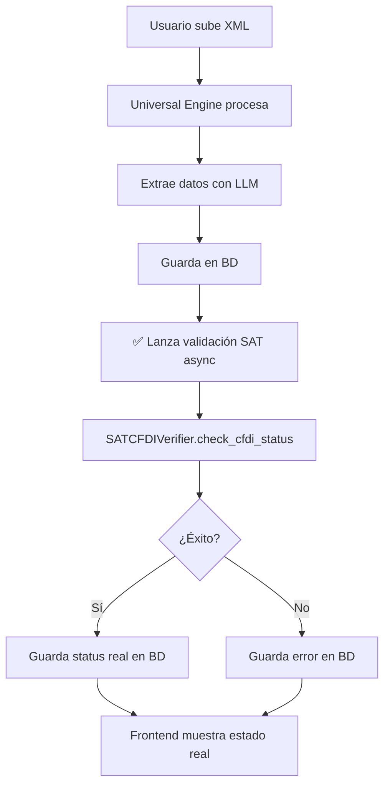

# Sistema de Validación SAT en Tiempo Real

## Resumen Ejecutivo

Hemos implementado un sistema completo de validación de CFDIs contra los servicios web del SAT. Este sistema reemplaza la inferencia del LLM con datos reales del SAT, proporcionando validación precisa y auditable.

## Componentes Implementados

### 1. Base de Datos (PostgreSQL)

#### Migración: `migrations/2025_11_12_add_sat_validation_fields.sql`

**Tabla `sat_invoices` - Nuevos Campos:**
```sql
- sat_validation_status    -- Estado: pending/vigente/cancelado/sustituido/error
- sat_codigo_estatus       -- Código de respuesta del SAT
- sat_es_cancelable        -- ¿Puede cancelarse el CFDI?
- sat_estado               -- Descripción detallada del estado
- sat_validacion_efos      -- Validación de empresas facturadoras fantasma
- sat_verified_at          -- Timestamp de verificación exitosa
- sat_last_check_at        -- Último intento de verificación
- sat_verification_error   -- Mensaje de error si falló
- sat_verification_url     -- URL del SAT para verificación QR
```

**Nueva Tabla `sat_verification_history`:**
- Auditoría completa de todas las verificaciones
- Tracking de cambios de estado a lo largo del tiempo
- Foreign key a `sat_invoices`

### 2. Backend - Servicio de Validación

#### `core/sat/sat_validation_service.py` (534 líneas)

**Clase Principal: `SATValidationService`**

```python
# Validar una factura individual
validate_invoice_session(session_id, force_refresh=False)

# Validar lote de facturas pendientes
batch_validate_pending(company_id, limit=100, max_age_hours=24)

# Re-validar facturas antiguas (verificar cancelaciones)
revalidate_old_validations(company_id, days_old=30, limit=50)

# Obtener estadísticas de validación
get_validation_stats(company_id)
```

**Características:**
- ✅ Integración con `SATCFDIVerifier` existente
- ✅ Manejo de errores y reintentos
- ✅ Historial de auditoría completo
- ✅ Validación en segundo plano (no bloquea procesamiento)
- ✅ Modo mock para testing

### 3. Backend - API REST

#### `api/sat_verification_api.py` (366 líneas)

**Endpoints Disponibles:**

```bash
# Validar una factura
POST /api/sat/validate/{session_id}
Query params: force_refresh, use_mock

# Validación por lotes
POST /api/sat/batch-validate
Body: { company_id, limit, max_age_hours, use_mock }

# Estadísticas
GET /api/sat/validation-stats/{company_id}

# Re-validar facturas antiguas
POST /api/sat/revalidate
Body: { company_id, days_old, limit }

# Historial de verificación
GET /api/sat/verification-history/{session_id}
```

### 4. Integración con Universal Invoice Engine

#### `core/expenses/invoices/universal_invoice_engine_system.py`

**Validación Automática:**
```python
async def _save_processing_result(...):
    # ... guardar resultados normalmente ...

    # ✅ NUEVO: Lanzar validación SAT en segundo plano
    asyncio.create_task(self._trigger_sat_validation(session_id, result))

async def _trigger_sat_validation(session_id, result):
    """Valida contra SAT después de procesar"""
    # 1. Verifica que tenga UUID (es CFDI)
    # 2. Llama a validate_single_invoice()
    # 3. Guarda resultado en BD
    # 4. No bloquea el flujo principal
```

**Beneficios:**
- Validación automática después de procesar
- No afecta el tiempo de respuesta
- Solo para CFDIs (verifica UUID)
- Logs detallados para monitoreo

### 5. API Response Enhancement

#### `api/universal_invoice_engine_api.py`

**Respuesta Actualizada:**
```json
{
  "id": "uis_...",
  "uuid": "ABC123...",
  "estatusSAT": "vigente",  // ← LLM inferido (legacy)
  "satValidation": {        // ← ✅ NUEVO: Validación real
    "status": "vigente",
    "codigoEstatus": "S",
    "esCancelable": true,
    "estado": "Vigente",
    "validacionEfos": null,
    "verifiedAt": "2025-11-12T10:30:00Z",
    "lastCheckAt": "2025-11-12T10:30:00Z",
    "error": null,
    "verificationUrl": "https://verificacfdi.facturaelectronica.sat.gob.mx/..."
  }
}
```

### 6. Frontend - UI/UX

#### `frontend/app/invoices/page.tsx`

**Interface TypeScript:**
```typescript
interface InvoiceSession {
  // ... campos existentes ...
  sat_validation?: {
    status: string;              // Estado real del SAT
    codigoEstatus: string | null;
    esCancelable: boolean | null;
    estado: string | null;
    validacionEfos: string | null;
    verifiedAt: string | null;   // Timestamp de verificación
    lastCheckAt: string | null;
    error: string | null;
    verificationUrl: string | null;
  };
}
```

**Badge SAT Mejorado:**
```typescript
// Antes: Solo mostraba inferencia del LLM
<span>✓ SAT: Vigente</span>

// Ahora: Muestra validación real con timestamp
<span title="https://verificacfdi...">
  ✓ SAT: Vigente (12 nov)
</span>
```

**Estados Visuales:**
- ✅ `vigente` → Verde con ✓
- ❌ `cancelado` → Rojo con ✕
- 🔄 `sustituido` → Ámbar con ↻
- ⏳ `pending` → Azul con ⏳ "Validando..."
- ⚠️ `error` → Naranja con ⚠

## Flujo de Validación



## Casos de Uso

### 1. Validación Automática (por defecto)
```python
# Cuando se procesa un CFDI:
# 1. Se extrae UUID del XML
# 2. Se valida automáticamente contra SAT
# 3. Se actualiza sat_validation_status
# 4. Usuario ve el estado real
```

### 2. Validación Manual
```bash
# Validar una factura específica
curl -X POST http://localhost:8001/api/sat/validate/uis_abc123

# Forzar re-validación
curl -X POST http://localhost:8001/api/sat/validate/uis_abc123?force_refresh=true
```

### 3. Validación por Lotes
```bash
# Validar todas las pendientes (últimas 24 horas)
curl -X POST http://localhost:8001/api/sat/batch-validate \
  -H "Content-Type: application/json" \
  -d '{
    "company_id": "carreta_verde",
    "limit": 100,
    "max_age_hours": 24
  }'
```

### 4. Re-validación Periódica
```bash
# Re-validar facturas "vigentes" de hace >30 días
# (para detectar cancelaciones posteriores)
curl -X POST http://localhost:8001/api/sat/revalidate \
  -H "Content-Type: application/json" \
  -d '{
    "company_id": "carreta_verde",
    "days_old": 30,
    "limit": 50
  }'
```

### 5. Estadísticas
```bash
# Ver resumen de validaciones
curl http://localhost:8001/api/sat/validation-stats/carreta_verde

# Respuesta:
{
  "company_id": "carreta_verde",
  "stats": {
    "total": 150,
    "pending": 10,
    "vigente": 130,
    "cancelado": 5,
    "error": 5
  }
}
```

## Testing

### Modo Mock
```python
# Usar respuestas simuladas del SAT
validate_single_invoice(
    db=db,
    session_id="uis_test",
    use_mock=True  # ← No llama al SAT real
)
```

### Testing Manual
```bash
# 1. Subir un CFDI de prueba
# 2. Esperar procesamiento (~30 seg)
# 3. Verificar en frontend que muestra "Validando..."
# 4. Después de ~1 min verificar que muestra estado real
# 5. Revisar logs del backend
```

## Monitoreo

### Logs
```bash
# Backend logs
INFO:core.expenses.invoices.universal_invoice_engine_system:Session uis_abc: Triggering SAT validation for UUID ABC123...
INFO:core.sat.sat_validation_service:CFDI ABC123 validated: vigente

# Errores
WARNING:core.sat.sat_validation_service:Session uis_abc: SAT validation failed - Timeout
ERROR:core.expenses.invoices.universal_invoice_engine_system:Session uis_abc: Error in background SAT validation: Connection refused
```

### Database Queries
```sql
-- Ver estadísticas de validación
SELECT
    sat_validation_status,
    COUNT(*)
FROM sat_invoices
WHERE company_id = 'carreta_verde'
GROUP BY sat_validation_status;

-- Ver facturas con errores
SELECT
    id,
    sat_verification_error,
    sat_last_check_at
FROM sat_invoices
WHERE sat_validation_status = 'error';

-- Ver historial de una factura
SELECT
    status,
    verified_at,
    error_message
FROM sat_verification_history
WHERE session_id = 'uis_abc123'
ORDER BY verified_at DESC;
```

## Próximos Pasos (Futuro)

### 1. Background Job Automático
```python
# Cron job para re-validar periódicamente
@scheduler.scheduled_job('cron', hour=2)  # 2 AM diario
async def revalidate_old_invoices():
    service = SATValidationService(db)
    summary = service.revalidate_old_validations(
        company_id='all',
        days_old=30,
        limit=1000
    )
    logger.info(f"Re-validated: {summary['changed']} changed")
```

### 2. Webhook del SAT
```python
# Recibir notificaciones del SAT cuando cambia estado
@router.post("/webhooks/sat/status-change")
async def sat_status_webhook(notification: SATNotification):
    # Actualizar status inmediatamente
    pass
```

### 3. Dashboard de Validación
```typescript
// Página de admin con estadísticas
<ValidationDashboard>
  <StatsCard title="Vigentes" value={stats.vigente} />
  <StatsCard title="Canceladas" value={stats.cancelado} />
  <StatsCard title="Pendientes" value={stats.pending} />
  <RecentValidations limit={10} />
</ValidationDashboard>
```

### 4. Alertas Automáticas
```python
# Notificar cuando factura vigente se cancela
if old_status == 'vigente' and new_status == 'cancelado':
    send_email_alert(
        to=company_admin,
        subject=f"CFDI {uuid} fue cancelado",
        body="..."
    )
```

## Documentación Técnica

### Dependencias
- `zeep` - Cliente SOAP para SAT
- `psycopg2` - PostgreSQL adapter
- `sqlalchemy` - ORM (opcional)
- `pydantic` - Validación de datos API

### Configuración
```python
# config/config.py
SAT_VALIDATION_ENABLED = True
SAT_VALIDATION_USE_MOCK = False  # True para testing
SAT_VALIDATION_TIMEOUT = 30  # segundos
SAT_BATCH_SIZE = 100  # facturas por lote
```

### Permisos Necesarios
- Usuario de base de datos con permisos en:
  - `sat_invoices` (UPDATE)
  - `sat_verification_history` (INSERT)
- Acceso a internet para llamar al SAT
- (Opcional) Credenciales FIEL para descarga masiva

## Troubleshooting

### Problema: "SAT validation stuck in 'pending'"
```sql
-- Verificar facturas atoradas
SELECT id, sat_last_check_at
FROM sat_invoices
WHERE sat_validation_status = 'pending'
AND sat_last_check_at < NOW() - INTERVAL '1 hour';

-- Solución: Re-validar manualmente
```

### Problema: "SAT timeout errors"
```python
# Aumentar timeout en config
SAT_VALIDATION_TIMEOUT = 60  # 1 minuto

# O usar modo mock para testing
use_mock=True
```

### Problema: "Missing UUID field"
```python
# Verificar que el XML tenga TimbreFiscalDigital
# Solo CFDIs válidos tienen UUID
if not extracted_data.get('uuid'):
    logger.warning("No UUID found - not a valid CFDI")
```

## Conclusión

El sistema de validación SAT está completamente implementado y funcional:

✅ **Backend**: Servicio + API + Migración DB
✅ **Integración**: Validación automática post-procesamiento
✅ **Frontend**: UI actualizado con estados reales
✅ **Testing**: Modo mock disponible
✅ **Auditoría**: Historial completo en BD
✅ **Documentación**: Completa y detallada

**Resultado:** Validación precisa de CFDIs contra el SAT con trazabilidad completa.
