# 🏗️ Resolución de Dependencias Circulares
## Refactorización Arquitectónica MCP Server

---

## 🚨 Análisis de Ciclos Identificados

### **🔄 Ciclo 1: Gastos ↔ Facturas ↔ Conciliación**

```mermaid
graph LR
    A[Gestión de Gastos] --> B[Procesamiento de Facturas]
    B --> C[Conciliación Bancaria]
    C --> A
```


**Riesgo**: Deadlocks en actualizaciones concurrentes
**Impacto**: Alto - Afecta funcionalidades core

### **🔄 Ciclo 2: Automatización ↔ Persistencia ↔ Worker**


**Riesgo**: State inconsistency
**Impacto**: Medio - Afecta sistema de automatización

### **🔄 Ciclo 3: Analytics ↔ Completado ↔ Predicción**

```mermaid
graph LR
    G[Analytics] --> H[Completado de Gastos]
    H --> I[Predicción Categorías]
    I --> G
```


**Riesgo**: Infinite loops en ML
**Impacto**: Medio - Afecta inteligencia del sistema

---

## 🎯 SOLUCIÓN 1: Event-Driven Architecture
### Para Ciclo 1 (Gastos ↔ Facturas ↔ Conciliación)

### Implementación con Event Bus

```python
# core/events.py
from enum import Enum
from typing import Dict, Any, Callable, List
from dataclasses import dataclass
from datetime import datetime
import asyncio
import logging

class EventType(Enum):
    EXPENSE_CREATED = "expense.created"
    EXPENSE_UPDATED = "expense.updated"
    INVOICE_PROCESSED = "invoice.processed"
    INVOICE_MATCHED = "invoice.matched"
    BANK_MOVEMENT_IMPORTED = "bank.movement.imported"
    RECONCILIATION_COMPLETED = "reconciliation.completed"

@dataclass
class Event:
    type: EventType
    data: Dict[str, Any]
    timestamp: datetime
    company_id: str
    source: str
    correlation_id: str

class EventBus:
    def __init__(self):
        self._handlers: Dict[EventType, List[Callable]] = {}
        self._logger = logging.getLogger(__name__)

    def subscribe(self, event_type: EventType, handler: Callable):
        """Subscribe handler to event type"""
        if event_type not in self._handlers:
            self._handlers[event_type] = []
        self._handlers[event_type].append(handler)

    async def publish(self, event: Event):
        """Publish event to all subscribers"""
        self._logger.info(f"Publishing event: {event.type} for company: {event.company_id}")

        if event.type in self._handlers:
            for handler in self._handlers[event.type]:
                try:
                    await handler(event)
                except Exception as e:
                    self._logger.error(f"Error in event handler: {e}")

# Singleton event bus
event_bus = EventBus()
```

### Refactored Components

```python
# modules/expense_service.py
from core.events import event_bus, Event, EventType
import uuid
from datetime import datetime

class ExpenseService:
    @staticmethod
    async def create_expense(expense_data: Dict[str, Any]) -> int:
        """Create expense without direct dependencies"""
        # Create expense in database
        expense_id = await db.create_expense(expense_data)

        # Publish event (no direct coupling)
        await event_bus.publish(Event(
            type=EventType.EXPENSE_CREATED,
            data={
                "expense_id": expense_id,
                "expense_data": expense_data,
                "amount": expense_data.get("monto_total"),
                "description": expense_data.get("descripcion"),
                "provider": expense_data.get("proveedor")
            },
            timestamp=datetime.utcnow(),
            company_id=expense_data.get("company_id", "default"),
            source="expense_service",
            correlation_id=str(uuid.uuid4())
        ))

        return expense_id

    @staticmethod
    async def update_expense(expense_id: int, updates: Dict[str, Any]) -> bool:
        """Update expense and notify via events"""
        success = await db.update_expense(expense_id, updates)

        if success:
            await event_bus.publish(Event(
                type=EventType.EXPENSE_UPDATED,
                data={
                    "expense_id": expense_id,
                    "updates": updates,
                    "previous_state": await db.get_expense(expense_id)
                },
                timestamp=datetime.utcnow(),
                company_id=updates.get("company_id", "default"),
                source="expense_service",
                correlation_id=str(uuid.uuid4())
            ))

        return success

# modules/invoice_service.py
class InvoiceService:
    @staticmethod
    async def process_invoice(invoice_data: Dict[str, Any]) -> Dict[str, Any]:
        """Process invoice without direct expense coupling"""
        # Process the invoice
        processed_invoice = await invoice_processor.process(invoice_data)

        # Publish event for potential matching
        await event_bus.publish(Event(
            type=EventType.INVOICE_PROCESSED,
            data={
                "invoice_id": processed_invoice["id"],
                "invoice_data": processed_invoice,
                "uuid": processed_invoice.get("uuid"),
                "total": processed_invoice.get("total"),
                "rfc_emisor": processed_invoice.get("rfc_emisor"),
                "matching_criteria": {
                    "amount_range": (
                        processed_invoice.get("total", 0) * 0.95,
                        processed_invoice.get("total", 0) * 1.05
                    ),
                    "date_range": processed_invoice.get("fecha_emision"),
                    "provider_rfc": processed_invoice.get("rfc_emisor")
                }
            },
            timestamp=datetime.utcnow(),
            company_id=processed_invoice.get("company_id", "default"),
            source="invoice_service",
            correlation_id=str(uuid.uuid4())
        ))

        return processed_invoice

# modules/bank_reconciliation_service.py
class BankReconciliationService:
    @staticmethod
    async def import_movement(movement_data: Dict[str, Any]) -> int:
        """Import bank movement without direct expense dependency"""
        movement_id = await db.create_bank_movement(movement_data)

        # Publish event for potential reconciliation
        await event_bus.publish(Event(
            type=EventType.BANK_MOVEMENT_IMPORTED,
            data={
                "movement_id": movement_id,
                "movement_data": movement_data,
                "amount": movement_data.get("amount"),
                "description": movement_data.get("description"),
                "date": movement_data.get("date"),
                "matching_criteria": {
                    "amount_tolerance": 0.05,  # 5% tolerance
                    "date_range_days": 7,
                    "description_similarity": 0.7
                }
            },
            timestamp=datetime.utcnow(),
            company_id=movement_data.get("company_id", "default"),
            source="bank_reconciliation_service",
            correlation_id=str(uuid.uuid4())
        ))

        return movement_id
```

### Event Handlers (Decoupled Logic)

```python
# modules/event_handlers.py
from core.events import event_bus, Event, EventType

class ExpenseInvoiceMatchingHandler:
    """Handles invoice matching when invoices are processed"""

    @staticmethod
    async def handle_invoice_processed(event: Event):
        """Match processed invoices with existing expenses"""
        invoice_data = event.data["invoice_data"]
        matching_criteria = event.data["matching_criteria"]

        # Find potential expense matches
        potential_matches = await db.find_matching_expenses(
            company_id=event.company_id,
            criteria=matching_criteria
        )

        best_match = None
        highest_confidence = 0.0

        for expense in potential_matches:
            confidence = calculate_matching_confidence(invoice_data, expense)
            if confidence > highest_confidence and confidence > 0.8:
                highest_confidence = confidence
                best_match = expense

        if best_match:
            # Create invoice record linked to expense
            await db.create_invoice_record(
                expense_id=best_match["id"],
                invoice_data=invoice_data,
                confidence=highest_confidence
            )

            # Publish match event
            await event_bus.publish(Event(
                type=EventType.INVOICE_MATCHED,
                data={
                    "expense_id": best_match["id"],
                    "invoice_id": invoice_data["id"],
                    "confidence": highest_confidence,
                    "match_type": "automatic"
                },
                timestamp=datetime.utcnow(),
                company_id=event.company_id,
                source="invoice_matching_handler",
                correlation_id=event.correlation_id
            ))

class BankReconciliationHandler:
    """Handles bank reconciliation when movements are imported"""

    @staticmethod
    async def handle_movement_imported(event: Event):
        """Attempt to reconcile bank movement with expenses"""
        movement_data = event.data["movement_data"]
        matching_criteria = event.data["matching_criteria"]

        # Find potential expense matches
        potential_expenses = await db.find_matching_expenses_for_reconciliation(
            company_id=event.company_id,
            criteria=matching_criteria,
            movement_data=movement_data
        )

        for expense in potential_expenses:
            confidence = calculate_reconciliation_confidence(movement_data, expense)

            if confidence > 0.85:  # High confidence auto-match
                await db.create_reconciliation_record(
                    expense_id=expense["id"],
                    movement_id=event.data["movement_id"],
                    confidence=confidence,
                    auto_matched=True
                )

                # Publish reconciliation event
                await event_bus.publish(Event(
                    type=EventType.RECONCILIATION_COMPLETED,
                    data={
                        "expense_id": expense["id"],
                        "movement_id": event.data["movement_id"],
                        "confidence": confidence,
                        "match_type": "automatic"
                    },
                    timestamp=datetime.utcnow(),
                    company_id=event.company_id,
                    source="bank_reconciliation_handler",
                    correlation_id=event.correlation_id
                ))
                break

# Register event handlers
def setup_event_handlers():
    """Setup all event handlers"""
    event_bus.subscribe(
        EventType.INVOICE_PROCESSED,
        ExpenseInvoiceMatchingHandler.handle_invoice_processed
    )

    event_bus.subscribe(
        EventType.BANK_MOVEMENT_IMPORTED,
        BankReconciliationHandler.handle_movement_imported
    )

    # Additional handlers for other events...

# Call during application startup
setup_event_handlers()
```

---

## 🎯 SOLUCIÓN 2: Saga Pattern
### Para Ciclo 2 (Automatización ↔ Persistencia ↔ Worker)

```python
# core/saga.py
from enum import Enum
from typing import Dict, Any, List, Optional
from dataclasses import dataclass
import asyncio
import uuid

class SagaStatus(Enum):
    STARTED = "started"
    IN_PROGRESS = "in_progress"
    COMPLETED = "completed"
    FAILED = "failed"
    COMPENSATING = "compensating"
    COMPENSATED = "compensated"

@dataclass
class SagaStep:
    name: str
    execute: callable
    compensate: callable
    timeout_seconds: int = 300

@dataclass
class SagaExecution:
    saga_id: str
    steps: List[SagaStep]
    status: SagaStatus
    current_step: int = 0
    context: Dict[str, Any] = None
    error: Optional[str] = None

class SagaManager:
    def __init__(self):
        self._active_sagas: Dict[str, SagaExecution] = {}

    async def execute_saga(self, saga_id: str, steps: List[SagaStep], context: Dict[str, Any]) -> bool:
        """Execute saga with compensation on failure"""
        execution = SagaExecution(
            saga_id=saga_id,
            steps=steps,
            status=SagaStatus.STARTED,
            context=context
        )

        self._active_sagas[saga_id] = execution

        try:
            execution.status = SagaStatus.IN_PROGRESS

            for i, step in enumerate(steps):
                execution.current_step = i

                try:
                    # Execute step with timeout
                    await asyncio.wait_for(
                        step.execute(execution.context),
                        timeout=step.timeout_seconds
                    )
                except Exception as e:
                    # Step failed, start compensation
                    execution.status = SagaStatus.COMPENSATING
                    execution.error = str(e)

                    await self._compensate(execution, i)
                    return False

            execution.status = SagaStatus.COMPLETED
            return True

        finally:
            del self._active_sagas[saga_id]

    async def _compensate(self, execution: SagaExecution, failed_step: int):
        """Run compensation for completed steps"""
        for i in range(failed_step - 1, -1, -1):
            step = execution.steps[i]
            try:
                await step.compensate(execution.context)
            except Exception as e:
                # Log compensation failure but continue
                pass

        execution.status = SagaStatus.COMPENSATED

# Singleton saga manager
saga_manager = SagaManager()
```

### Automation Workflow Implementation

```python
# modules/automation_saga.py
from core.saga import SagaStep, saga_manager
import uuid

class AutomationSaga:
    """Manages automation workflow without circular dependencies"""

    @staticmethod
    async def execute_automation_workflow(ticket_id: int, company_id: str) -> bool:
        """Execute complete automation workflow using saga pattern"""

        saga_id = str(uuid.uuid4())
        context = {
            "ticket_id": ticket_id,
            "company_id": company_id,
            "automation_session_id": None,
            "worker_task_id": None,
            "portal_config": None,
            "automation_result": None
        }

        steps = [
            SagaStep(
                name="create_automation_session",
                execute=AutomationSaga._create_session,
                compensate=AutomationSaga._cleanup_session
            ),
            SagaStep(
                name="queue_worker_task",
                execute=AutomationSaga._queue_task,
                compensate=AutomationSaga._cancel_task
            ),
            SagaStep(
                name="execute_automation",
                execute=AutomationSaga._execute_automation,
                compensate=AutomationSaga._rollback_automation,
                timeout_seconds=600  # 10 minutes for automation
            ),
            SagaStep(
                name="persist_results",
                execute=AutomationSaga._persist_results,
                compensate=AutomationSaga._cleanup_results
            )
        ]

        return await saga_manager.execute_saga(saga_id, steps, context)

    @staticmethod
    async def _create_session(context: Dict[str, Any]):
        """Step 1: Create automation session"""
        session_id = await db.create_automation_session(
            company_id=context["company_id"],
            ticket_id=context["ticket_id"],
            status="initializing"
        )
        context["automation_session_id"] = session_id

    @staticmethod
    async def _cleanup_session(context: Dict[str, Any]):
        """Compensation: Cleanup session"""
        if context.get("automation_session_id"):
            await db.delete_automation_session(context["automation_session_id"])

    @staticmethod
    async def _queue_task(context: Dict[str, Any]):
        """Step 2: Queue worker task"""
        task_id = await worker_service.queue_automation_task(
            session_id=context["automation_session_id"],
            task_type="portal_automation",
            priority="normal"
        )
        context["worker_task_id"] = task_id

    @staticmethod
    async def _cancel_task(context: Dict[str, Any]):
        """Compensation: Cancel worker task"""
        if context.get("worker_task_id"):
            await worker_service.cancel_task(context["worker_task_id"])

    @staticmethod
    async def _execute_automation(context: Dict[str, Any]):
        """Step 3: Execute automation (decoupled)"""
        automation_result = await automation_engine.execute_portal_automation(
            session_id=context["automation_session_id"],
            task_id=context["worker_task_id"]
        )
        context["automation_result"] = automation_result

    @staticmethod
    async def _rollback_automation(context: Dict[str, Any]):
        """Compensation: Rollback automation state"""
        if context.get("automation_session_id"):
            await automation_engine.cleanup_session(context["automation_session_id"])

    @staticmethod
    async def _persist_results(context: Dict[str, Any]):
        """Step 4: Persist automation results"""
        await persistence_service.save_automation_results(
            session_id=context["automation_session_id"],
            results=context["automation_result"]
        )

    @staticmethod
    async def _cleanup_results(context: Dict[str, Any]):
        """Compensation: Cleanup persisted results"""
        if context.get("automation_session_id"):
            await persistence_service.cleanup_results(context["automation_session_id"])
```

---

## 🎯 SOLUCIÓN 3: Circuit Breaker Pattern
### Para Ciclo 3 (Analytics ↔ Completado ↔ Predicción)

```python
# core/circuit_breaker.py
from enum import Enum
import time
import asyncio
from typing import Dict, Any, Callable

class CircuitState(Enum):
    CLOSED = "closed"      # Normal operation
    OPEN = "open"          # Circuit is open, calls fail fast
    HALF_OPEN = "half_open" # Testing if service is back

class CircuitBreaker:
    def __init__(self, failure_threshold: int = 5, timeout: int = 60, success_threshold: int = 3):
        self.failure_threshold = failure_threshold
        self.timeout = timeout
        self.success_threshold = success_threshold

        self.failure_count = 0
        self.success_count = 0
        self.state = CircuitState.CLOSED
        self.last_failure_time = None

    async def call(self, func: Callable, *args, **kwargs):
        """Execute function with circuit breaker protection"""

        if self.state == CircuitState.OPEN:
            if self._should_attempt_reset():
                self.state = CircuitState.HALF_OPEN
                self.success_count = 0
            else:
                raise Exception("Circuit breaker is OPEN")

        try:
            result = await func(*args, **kwargs)
            self._on_success()
            return result
        except Exception as e:
            self._on_failure()
            raise e

    def _should_attempt_reset(self) -> bool:
        """Check if enough time has passed to attempt reset"""
        if self.last_failure_time is None:
            return True
        return time.time() - self.last_failure_time >= self.timeout

    def _on_success(self):
        """Handle successful call"""
        if self.state == CircuitState.HALF_OPEN:
            self.success_count += 1
            if self.success_count >= self.success_threshold:
                self.state = CircuitState.CLOSED
                self.failure_count = 0
        else:
            self.failure_count = 0

    def _on_failure(self):
        """Handle failed call"""
        self.failure_count += 1
        self.last_failure_time = time.time()

        if self.failure_count >= self.failure_threshold:
            self.state = CircuitState.OPEN

# Circuit breakers for ML services
analytics_circuit = CircuitBreaker(failure_threshold=3, timeout=120)
category_prediction_circuit = CircuitBreaker(failure_threshold=5, timeout=60)
completion_circuit = CircuitBreaker(failure_threshold=3, timeout=90)
```

### ML Services with Circuit Breaker

```python
# modules/ml_services.py
from core.circuit_breaker import analytics_circuit, category_prediction_circuit, completion_circuit

class MLServices:
    """ML services with circuit breaker protection"""

    @staticmethod
    async def get_analytics_data(company_id: str, query: Dict[str, Any]) -> Dict[str, Any]:
        """Get analytics with circuit breaker protection"""
        async def _get_analytics():
            # Actual analytics logic here
            return await analytics_engine.compute_analytics(company_id, query)

        try:
            return await analytics_circuit.call(_get_analytics)
        except Exception:
            # Fallback to cached data
            return await cache_service.get_analytics_fallback(company_id, query)

    @staticmethod
    async def predict_category(expense_data: Dict[str, Any]) -> Dict[str, Any]:
        """Predict category with circuit breaker protection"""
        async def _predict_category():
            return await category_predictor.predict(expense_data)

        try:
            return await category_prediction_circuit.call(_predict_category)
        except Exception:
            # Fallback to rule-based prediction
            return rule_based_predictor.predict(expense_data)

    @staticmethod
    async def complete_expense_data(expense_id: int, user_context: Dict[str, Any]) -> Dict[str, Any]:
        """Complete expense data with circuit breaker protection"""
        async def _complete_expense():
            return await expense_completer.complete(expense_id, user_context)

        try:
            return await completion_circuit.call(_complete_expense)
        except Exception:
            # Fallback to basic completion
            return basic_completer.complete(expense_id, user_context)
```

---

## 📊 Implementation Checklist

### Phase 1: Event-Driven Architecture (2 weeks)
- [ ] Implement EventBus system
- [ ] Create Event models and types
- [ ] Refactor Expense service to use events
- [ ] Refactor Invoice service to use events
- [ ] Refactor Bank reconciliation service to use events
- [ ] Implement event handlers
- [ ] Add event persistence for reliability
- [ ] Test event flow end-to-end

### Phase 2: Saga Pattern (2 weeks)
- [ ] Implement SagaManager
- [ ] Create automation workflow saga
- [ ] Implement compensation logic
- [ ] Add saga persistence
- [ ] Test failure scenarios
- [ ] Add monitoring and alerting
- [ ] Document saga workflows

### Phase 3: Circuit Breaker Pattern (1 week)
- [ ] Implement CircuitBreaker class
- [ ] Add circuit breakers to ML services
- [ ] Implement fallback mechanisms
- [ ] Add monitoring for circuit states
- [ ] Test failure scenarios
- [ ] Configure thresholds and timeouts

### Phase 4: Integration and Testing (1 week)
- [ ] Integration testing of all patterns
- [ ] Performance testing
- [ ] Load testing
- [ ] Monitoring setup
- [ ] Documentation update
- [ ] Training materials

---

## 🚀 Expected Benefits

### **Reliability**
- ✅ Eliminated deadlock risks
- ✅ Better error recovery
- ✅ Graceful degradation

### **Scalability**
- ✅ Decoupled components
- ✅ Async processing
- ✅ Better resource utilization

### **Maintainability**
- ✅ Clear separation of concerns
- ✅ Easier testing
- ✅ Better debugging

### **Performance**
- ✅ Reduced blocking operations
- ✅ Improved throughput
- ✅ Better caching strategies

---

**📅 Implementation Timeline**: 6 semanas
**🎯 Success Criteria**: Zero circular dependencies, 99.9% uptime
**📋 Next Review**: Post-implementation analysis